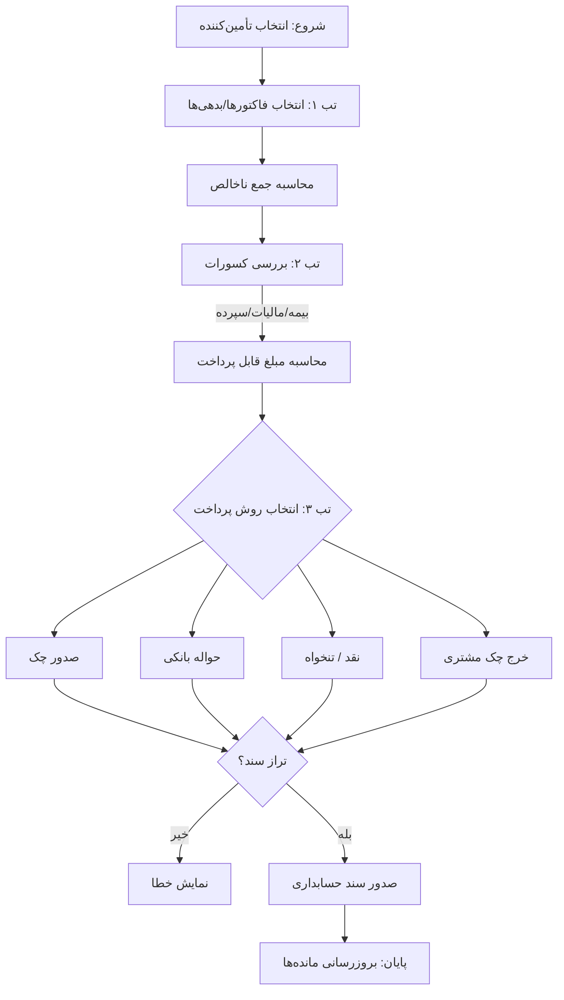

# مستندات جامع فنی: ماژول سند پرداخت (Payment Vouchers)

## ۱. مقدمه: تغییر پارادایم از «خرج کردن» به «مدیریت تعهدات»

در سیستم‌های حسابداری سنتی، پرداخت صرفاً به معنای «نوشتن یک چک» است. اما در معماری ERP تابان، سند پرداخت آخرین حلقه از زنجیره تأمین (Supply Chain) است.

> **«پول نقد، خونِ سازمان است.»**

مدیریت خروج این خون حیاتی، نیازمند مکانیزمی است که مطمئن شود هر ریالی که از سازمان خارج می‌شود، دقیقاً در ازای یک «تعهد تایید شده» و با رعایت «الزامات قانونی» صورت گرفته است.

ماژول پرداخت، یک **گیت وی (Gateway)** کنترلی است که سه شرط را قبل از خروج پول بررسی می‌کند:

1.  **مشروعیت (Validity):** آیا بدهی وجود دارد و تایید شده است؟ (تخصیص).
2.  **خالص‌سازی (Netting):** آیا سهم دولت و سپرده‌ها کسر شده است؟ (کسورات).
3.  **قابلیت اجرا (Execution):** آیا موجودی و ابزار پرداخت معتبر است؟ (روش پرداخت).

-----

## ۲. معماری داده‌ها و انواع پرداخت (Payment Architecture)

فیلد `PaymentType` در سربرگ، نقش **کنترل‌کننده (Controller)** رفتار فرم را دارد. انتخاب نوع پرداخت، قوانین اعتبارسنجی و حساب‌های GL درگیر را تغییر می‌دهد.

### جدول استراتژی انواع پرداخت

| نوع پرداخت (Type) | نام فنی (Enum) | سناریوی بیزینس | رفتار فرم و محدودیت‌ها |
| :--- | :--- | :--- | :--- |
| **پرداخت تجاری** | `VendorPayment` | تسویه فاکتور خرید یا صورت‌وضعیت پیمانکار. | **تأمین‌کننده الزامی.** تب تخصیص و کسورات فعال. |
| **پیش‌پرداخت** | `Prepayment` | پرداخت قبل از دریافت کالا (بیعانه). | اتصال به **سفارش خرید (PO)**. تب تخصیص غیرفعال (چون فاکتوری نیست). |
| **هزینه مستقیم** | `DirectExpense` | هزینه‌های بدون فاکتور خرید (شارژ، ایاب‌ذهاب، پذیرایی). | اتصال مستقیم به **کد حساب هزینه (GL Account)**. بدون نیاز به تأمین‌کننده تعریف شده. |
| **حقوق و دستمزد** | `Salary` | پرداخت ماهانه پرسنل. | اتصال به ماژول حقوق (HR). معمولاً گروهی (Batch) صادر می‌شود. |
| **پرداخت قانونی** | `TaxAuthority` | پرداخت بیمه و مالیات کسر شده به دولت. | طرف حساب: سازمان تامین اجتماعی / دارایی. اتصال به مانده حساب‌های معین بدهی. |

-----

## ۳. فرم عملیاتی: کالبدشکافی سند پرداخت

**مسیر دسترسی:** `خزانه‌داری > عملیات > پرداخت جدید`

این فرم از ۴ بخش اصلی تشکیل شده است که جریان داده‌ها را از «تعهد» به «تسویه» هدایت می‌کند.

### ۳-۱. بخش سربرگ (Header) - زمینه و هویت

این بخش مشخص می‌کند "چه کسی، چه زمانی و چه مبلغی" را دریافت می‌کند.

| فیلد | شرح فنی و بیزینس | قوانین اعتبارسنجی (Validation) |
| :--- | :--- | :--- |
| **شماره سند** | شناسه یکتا (`PAY-1403-1001`). | تولید خودکار (Auto-Increment) و غیرقابل ویرایش. |
| **وضعیت** | چرخه حیات (`Draft`, `Approved`, `Posted`). | تغییر وضعیت فقط از طریق Workflow انجام می‌شود. |
| **بنگاه اقتصادی** | واحد تجاری پرداخت‌کننده. | فیلتر کردن حساب‌های بانکی بر اساس شعبه انتخابی. |
| **دریافت‌کننده** | `PayeeID` (تأمین‌کننده / کارمند / تفصیلی شناور). | لیست بر اساس `PaymentType` فیلتر می‌شود. |
| **تاریخ پرداخت** | تاریخ مؤثر خروج پول. | نباید در دوره مالی بسته شده باشد. |
| **مبلغ قابل پرداخت** | `PayableAmount`. | **منطق دوگانه:**   1. **اتوماتیک:** برابر با (تخصیص - کسورات).   2. **دستی (On-Account):** کاربر مبلغ را دستی وارد می‌کند (پرداخت علی‌الحساب). |

-----

### ۳-۲. تب اول: تخصیص (Allocation) - "بابت چیست؟"

در این تب، سیستم به سوال **"این پول کدام بدهی را صاف می‌کند؟"** پاسخ می‌دهد.
سیستم تمام اسناد باز (Open Items) طرف حساب را واکشی می‌کند.

**منابع قابل تخصیص (Source Documents):**

1.  **فاکتور خرید (Purchase Invoice):** بدهی ناشی از خرید کالا.
2.  **صورت‌وضعیت (Statement):** بدهی ناشی از خدمات پیمانکاری.
3.  **سند افتتاحیه (Opening Balance):** بدهی‌های سنواتی.
4.  **اعلامیه بدهکار (Debit Note):** بدهی‌های متفرقه/اصلاحی.

**نکته کلیدی (Gross Debt):** مبلغی که اینجا نمایش داده می‌شود، **مبلغ کل فاکتور** (اصل + ارزش افزوده) است. ارزش افزوده قبلاً در فاکتور خرید لحاظ شده و اینجا بخشی از بدهی عادی است.

| انتخاب | نوع مرجع | شماره | مبلغ کل بدهی | مانده باز | مبلغ تخصیص (Gross) |
| :---: | :--- | :--- | :--- | :--- | :--- |
| ☑️ | صورت‌وضعیت | ST-101 | 100,000,000 | 100,000,000 | **100,000,000** |
| ☑️ | فاکتور خرید | PUR-505 | 20,000,000 | 20,000,000 | **20,000,000** |

-----

### ۳-۳. تب دوم: کسورات (Deductions) - "خالص‌سازی"

این تب قلب تپنده حسابداری پیمانکاری است. جایی که "حقوق قانونی و قراردادی" قبل از پرداخت کسر می‌شود.

**فلسفه:** خزانه‌دار نباید درگیر محاسبات پیچیده مالیاتی شود. این تب معمولاً **فقط خواندنی (Read-Only)** است و داده‌ها را از "قرارداد خرید" یا "درخواست پرداخت تایید شده" می‌خواند.

**انواع کسورات رایج:**

1.  **سپرده بیمه (SSO Deposit):** ماده ۳۸ (معمولاً ۱۶.۶۷٪ یا ۵٪).
2.  **مالیات تکلیفی (WHT):** ماده ۱۰۴ (تکلیف قانونی).
3.  **حسن انجام کار (Retention):** ضمانت کیفی (معمولاً ۱۰٪).
4.  **پیش‌پرداخت مستهلک شده:** کسر پیش‌پرداخت‌های داده شده قبلی از صورت‌وضعیت جاری.

$$Net Payable = \sum(Allocated Gross) - \sum(Deductions)$$

-----

### ۳-۴. تب سوم: ابزار پرداخت (Instruments) - "اجرا"

خزانه‌دار باید دقیقاً به اندازه **"مبلغ خالص قابل پرداخت"**، خروجی صندوق/بانک تعریف کند.

#### الف) صدور چک (Check Issuance)

سیستم باید چرخه حیات چک‌های صادر شده (برگه چک خام $\rightarrow$ امضا شده $\rightarrow$ پاس شده) را مدیریت کند.

  * **دسته چک:** انتخاب دسته چک فعال.
  * **شماره سریال:** انتخاب از لیست سریال‌های سفید (جلوگیری از تایپ دستی).
  * **وضعیت چک:** `Issued` (صادر شده).

#### ب) حواله بانکی (Wire Transfer / Paya / Satna)

  * **حساب مقصد:** \**کنترل امنیتی (IBAN Lock):**\</span\> کاربر مجاز به تایپ شماره شبا نیست. باید یکی از حساب‌های تایید شده در پروفایل تأمین‌کننده انتخاب شود (جلوگیری از کلاهبرداری داخلی).
  * **شماره پیگیری:** `TraceNo`.

#### ج) خرج چک (Endorsement)

استفاده از چک‌های مشتریان برای پرداخت به تأمین‌کننده.

  * **منبع:** انتخاب از لیست "چک‌های موجود در صندوق" (On Hand Checks).
  * **اثر مالی:** کاهش حساب "اسناد دریافتنی" (نه بانک\!).

#### د) پرداخت نقدی (Cash)

مخصوص تنخواه‌گردان و هزینه‌های خرد.

-----

## ۴. موتور کنترل و اعتبارسنجی (Validation Engine)

### ۴-۱. کنترل تراز (Accounting Balance)

سیستم اجازه ثبت (`Post`) را نمی‌دهد مگر معادله زیر برقرار باشد:

$$(\text{Gross Allocation}) - (\text{Total Deductions}) = (\text{Cheque} + \text{Cash} + \text{Transfer})$$

### ۴-۲. کنترل‌های امنیتی (Security Checks)

1.  **جلوگیری از پرداخت تکراری:** اگر برای فاکتور انتخابی، قبلاً سندی در وضعیت `Submitted` یا `Posted` وجود داشته باشد، سیستم خطا می‌دهد.
2.  **کنترل سقف تخصیص:** `Allocated Amount` $\le$ `Open Balance`.
3.  **کنترل موجودی منفی:** هشدار در صورت عدم موجودی کافی در حساب بانکی/صندوق انتخاب شده.

-----

## ۵. موتور صدور سند حسابداری (GL Engine)

سیستم به صورت اتوماتیک بر اساس سناریوی ترکیبی زیر، سند حسابداری را صادر می‌کند:

**سناریو:** پرداخت صورت‌وضعیت ۱۲۰ میلیونی پیمانکار با کسر بیمه/مالیات/حسن انجام کار و کسر هزینه کارمزد بانکی.

| ردیف | ماهیت | شرح حساب (GL) | بدهکار (Dr) | بستانکار (Cr) | منشأ دیتا |
| :--- | :--- | :--- | :--- | :--- | :--- |
| ۱ | بدهی | **حساب‌های پرداختنی تجاری** | ۱۲۰,۰۰۰,۰۰۰ | -- | تب تخصیص (بدهی کل) |
| ۲ | هزینه | **هزینه کارمزد بانکی** | ۵,۰۰۰ | -- | تب پرداخت (فیلد کارمزد) |
| ۳ | دارایی | **موجودی بانک ملت** | -- | ۳۸,۳۳۵,۰۰۰ | تب پرداخت (حواله) |
| ۴ | بدهی | **اسناد پرداختنی (چک)** | -- | ۵۰,۰۰۰,۰۰۰ | تب پرداخت (چک) |
| ۵ | بدهی | **سازمان تامین اجتماعی (بیمه)** | -- | ۱۶,۶۷۰,۰۰۰ | تب کسورات |
| ۶ | بدهی | **سازمان امور مالیاتی (تکلیفی)** | -- | ۵,۰۰۰,۰۰۰ | تب کسورات |
| ۷ | بدهی | **سپرده حسن انجام کار** | -- | ۱۰,۰۰۰,۰۰۰ | تب کسورات |

-----

## ۶. دیاگرام جریان فرآیند (Process Flow Diagram)

-----

## ۷. پرسش‌های متداول (FAQ)

**س۱: آیا مالیات بر ارزش افزوده (VAT) در تب کسورات می‌آید؟**

  * **پاسخ:** خیر\! این بزرگترین اشتباه رایج است. ارزش افزوده در زمان "خرید" به مبلغ بدهی تأمین‌کننده اضافه شده است. در اینجا شما کل مبلغ (جنس + ارزش افزوده) را بدهکارید و پرداخت می‌کنید. تب کسورات فقط برای مبالغی است که **نباید** به پیمانکار بدهید (مثل بیمه و مالیات تکلیفی).

**س۲: اگر بخواهم بخشی از پول را بدهم (پرداخت جزئی)، سیستم چه می‌کند؟**

  * **پاسخ:** در تب تخصیص، ستون "مبلغ تخصیص" قابل ویرایش است. اگر بدهی ۱۰۰ واحد است و شما ۵۰ واحد وارد کنید، وضعیت فاکتور `Open` می‌ماند اما مانده آن ۵۰ واحد کاهش می‌یابد.

**س۳: چک روز (نقد) با چک مدت‌دار چه تفاوتی در سیستم دارد؟**

  * **پاسخ:** در ماژول پرداخت تفاوتی ندارند (هر دو اسناد پرداختنی هستند). اما در زمان "پاس شدن چک"، اگر چک روز باشد همان لحظه از بانک کم می‌شود، ولی اگر مدت‌دار باشد، در تاریخ سررسید و پس از عملیات "اعلام وصول" (Clearing) از حساب بانک کسر می‌گردد.

**س۴: فرآیند استرداد چک (برگشت زدن چک صادره) چگونه است؟**

  * **پاسخ:** اگر چکی که داده‌اید پاس نشد یا عودت شد، نباید سند پرداخت را حذف کنید. باید از فرآیند **«ابطال چک» (Void Check)** استفاده کنید تا سیستم یک سند معکوس (Reverse Entry) صادر کند و بدهی تأمین‌کننده دوباره احیا شود.