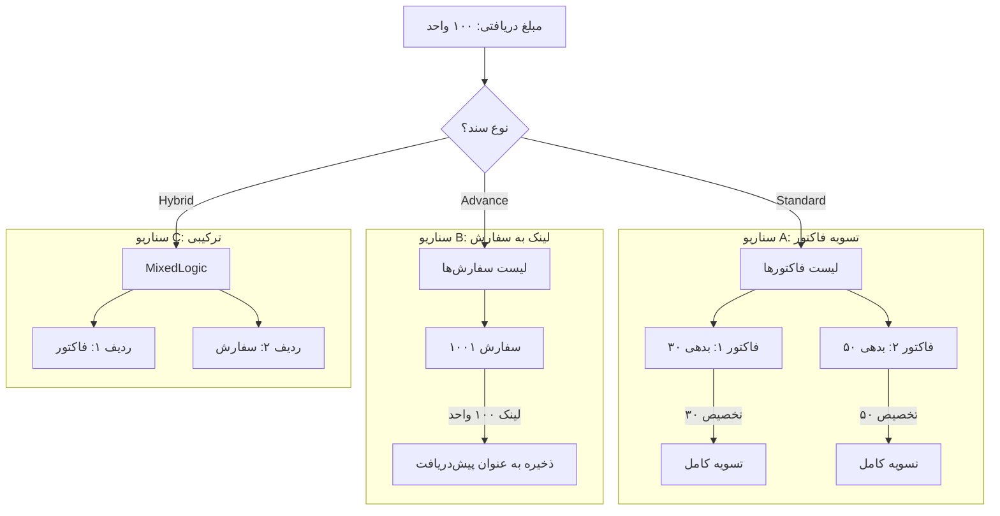
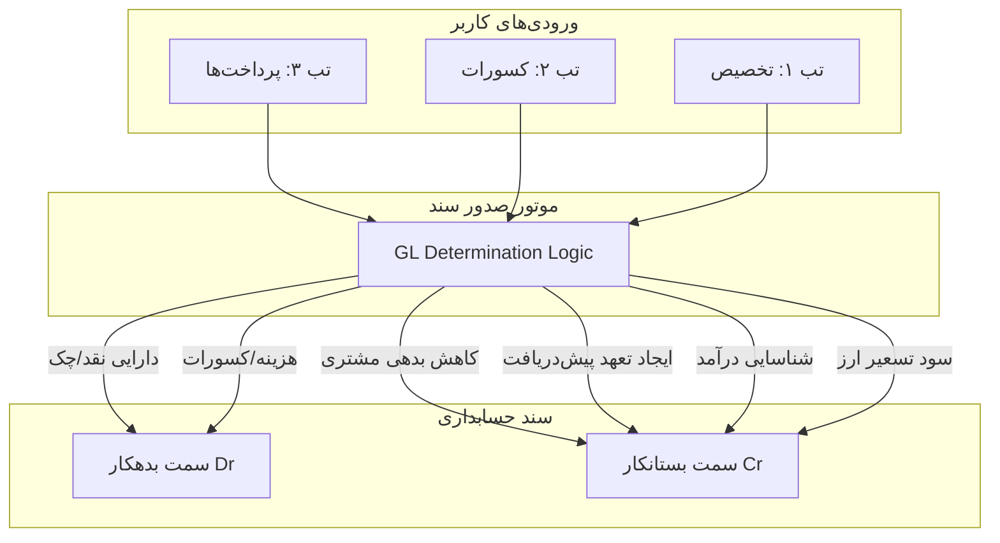

# اسناد دریافت (Receipt Vouchers)

## مقدمه

در ادبیات تجاری و مدیریت مالی، جمله‌ای کلیدی وجود دارد که ماهیت کسب‌وکارهای B2B را تعریف می‌کند:
> **«فروش واقعی زمانی اتفاق می‌افتد که پول به حساب بنشیند؛ قبل از آن، همه چیز فقط یک هدیه یا تعهد بوده است!»**

ماژول **«سند دریافت» (Receipt Voucher)** در سیستم‌های ERP (مانند تابان)، دقیقاً مسئولیت تبدیل این «هدیه» به «نقدینگی واقعی» را بر عهده دارد. برخلاف نرم‌افزارهای ساده فروشگاهی که دریافت پول را صرفاً ثبت یک عدد در صندوق می‌دانند، در سازمان‌های متوسط و بزرگ، این فرم یک **«نقطه عطف استراتژیک»** است.

این ماژول نقش **«پل ارتباطی»** و نقطه تلاقی سه زیرسیستم اصلی سازمان است:

1.  **زیرسیستم فروش (Sales):** که پیش‌تر با صدور فاکتور، یک «بدهی» و «تعهد» برای مشتری ایجاد کرده است.
2.  **زیرسیستم خزانه‌داری (Treasury):** که مسئولیت حفاظت فیزیکی و مدیریت گردش دارایی‌ها (پول نقد، چک، حواله) را دارد.
3.  **زیرسیستم حسابداری (General Ledger):** که باید دفاتر کل را تراز کرده، ماهیت حساب‌ها را تغییر دهد و اسناد دوبل را صادر کند.

بنابراین، سند دریافت **«نقطه پایان»** چرخه فروش و **«نقطه شروع»** چرخه مدیریت نقدینگی است.


---

## چه زمانی به سراغ این سند می‌آییم؟
کاربران سیستم (خزانه‌داران یا حسابداران فروش) معمولاً در ۳ موقعیت کلیدی و متمایز نیاز به ثبت سند دریافت پیدا می‌کنند. هر یک از این موقعیت‌ها نیاز خاصی را پاسخ می‌دهد:

### الف) سناریوی اول: تسویه بدهی‌های گذشته (The Settlement)

* **وضعیت:** کالا یا خدمات در گذشته (مثلاً هفته پیش) تحویل شده و فاکتور رسمی صادر شده است. حساب مشتری اکنون بدهکار است.
* **اتفاق:** مشتری امروز چک می‌فرستد یا مبلغی را به حساب شرکت واریز می‌کند.
* **هدف سیستمی:** «می‌خواهیم به سیستم بفهمانیم که آقای مشتری دیگر بدهکار نیست.» در اینجا سند دریافت نقش **پاک‌کننده بدهی (Clearing)** را بازی می‌کند تا مانده حساب مشتری با واقعیت منطبق شود.

### ب) سناریوی دوم: پیش‌دریافت و رزرو (The Advance Payment)
* **وضعیت:** مشتری سفارش خریدی ثبت کرده، اما طبق سیاست شرکت یا قرارداد فی‌مابین، تا زمانی که ۳۰٪ مبلغ کل قرارداد پرداخت نشود، کالا از انبار خارج نخواهد شد.

* **اتفاق:** مشتری مبلغ بیعانه را واریز می‌کند.
* **هدف سیستمی:** «می‌خواهیم این پول را دریافت کرده و مشخصاً برای همین سفارش خاص **رزرو (Allocate)** کنیم.» در این حالت، سند دریافت مجوزی برای واحد فروش و انبار است تا فرآیند تحویل کالا را آغاز کنند.

### ج) سناریوی سوم: درآمدهای غیرتجاری (The Miscellaneous)

* **وضعیت:** مبالغی وارد حساب‌های شرکت می‌شود که ناشی از عملیات اصلی فروش نیست.
* **اتفاق:** بانک سود سپرده ماهانه را واریز می‌کند، یا ضایعات کارتن‌های انبار به صورت نقدی به یک خریدار رهگذر فروخته می‌شود.
* **هدف سیستمی:** «پولی وارد شرکت شده که طرف حساب آن مشتری تجاری نیست، اما باید در سیستم ثبت شود تا موجودی بانک یا صندوق با واقعیت فیزیکی همخوانی (Reconciliation) داشته باشد.»

---

## ضرورت و کارکردها
اگر فرآیند دریافت صرفاً به «گرفتن پول» محدود می‌شد، نیازی به این حجم از پیچیدگی نبود. اهمیت این سند در ۴ کارکرد حیاتی آن نهفته است:

### ۱. شفاف‌سازی حساب مشتری (Clearing AR)
بدون سند دریافت، سیستم فروش همچنان مشتری را بدهکار می‌داند. این سند مانند یک مکانیزم **تهاتر** عمل می‌کند که بدهی‌های باز (Open Invoices) را شناسایی کرده و با دارایی ورودی تسویه می‌کند.

### ۲. مدیریت هوشمند کسورات (Handling Deductions)
این مهم‌ترین چالش در حسابداری فروش است. پول دریافتی به ندرت دقیقاً با مبلغ فاکتور برابر است.

* **چالش:** مشتری باید ۱۰۰ میلیون تومان پرداخت می‌کرد، اما چک ۸۵ میلیون تومانی داده است.
* **نقش سند:** این سند تنها جایی است که حسابدار می‌تواند تعیین تکلیف کند که آن ۱۵ میلیون تومان اختلاف چیست؟
    * آیا تخفیف نقدی بوده؟ (هزینه تخفیفات)
    * آیا کسورات بیمه و مالیات تکلیفی بوده؟ (انتقال بدهی از مشتری به سازمان‌های دولتی)
    * آیا اشتباه واریزی است؟ (بستانکاری مشتری)

### ۳. تبدیل تعهد به دارایی (Realization)
فاکتور فروش صرفاً یک «کاغذ» و یک «حق حقوقی» است. سند دریافت ابزاری است که ماهیت این حق را به «دارایی ملموس» (وجه نقد یا اسناد تجاری) تغییر می‌دهد و ترازنامه شرکت را واقعی می‌کند.

### ۴. رهگیری چرخه حیات چک (Instrument Tracking)
در محیط تجاری ایران، بخش بزرگی از دریافت‌ها با **چک** انجام می‌شود. سند دریافت محل **«تولد چک»** در سیستم است. تا چک در اینجا ثبت نشود، سیستم نمی‌تواند سررسید آن را هشدار دهد، امکان واگذاری به بانک (کلر) را فراهم کند یا در صورت برگشت خوردن، فرآیند حقوقی را آغاز نماید.

---

## کالبدشکافی معماری: جریان ۴ لایه‌ای داده‌ها (Data Flow)
در طراحی سیستم تابان، برخلاف نگاه سنتی و خطی، پردازش سند دریافت بر اساس یک منطق **«مهندسی معکوس»** و در ۴ لایه مجزا اما به هم پیوسته انجام می‌شود:

### لایه ۱: شناسایی و بستر (Context & Identification)
در این لایه، «سربرگ» (Header) سند شکل می‌گیرد.

* **سوالات کلیدی:** پرداخت‌کننده کیست؟ تاریخ دریافت چه زمانی است؟ ارز مبادله چیست؟
* **نکته فنی:** ثبت دقیق نرخ ارز در این لحظه حیاتی است. اگر بین زمان صدور فاکتور و زمان دریافت پول، نرخ ارز تغییر کرده باشد، سیستم در همین لایه مقدمات محاسبه **سود و زیان ناشی از تسعیر ارز** را فراهم می‌کند.

### لایه ۲: منطق تخصیص (Allocation Logic)
این لایه مغز متفکر سیستم است. صرف اینکه مانده حساب مشتری صفر شود کافی نیست؛ باید مشخص شود این پول دقیقاً کدام فاکتور را پاس کرده است.

* **اهمیت:** اگر تخصیص در سطح فاکتور انجام نشود، در **«گزارش سنی مطالبات» (Aging Report)**، فاکتورهای قدیمی همچنان «باز» و معوق نمایش داده می‌شوند، در حالی که یک پول «آزاد» در حساب مشتری وجود دارد. سیستم باید دقیقاً لینک کند که: *"این چک ۵۰ تومانی، فاکتور شماره INV-101 را تسویه کرد."*

### لایه ۳: مدیریت مغایرت‌ها (Discrepancy & Deductions)
این لایه مسئول پاسخ به سوال «اختلاف مبلغ فاکتور و مبلغ دریافتی» است.

* **عملکرد:** در اینجا کاربر (حسابدار) با استفاده از کدهای دلیل (Reason Codes)، ماهیت اختلاف را مشخص می‌کند. مثلاً مشخص می‌کند که مبلغ کسر شده «سوخت» نشده، بلکه ماهیت آن از «طلب از مشتری» به «طلب از سازمان تأمین اجتماعی» (بابت سپرده بیمه) تغییر یافته است. این دقیق‌ترین بخش حسابداری پیمانکاری است.

### لایه ۴: ابزار تسویه (Settlement Instrument)
در لایه آخر، سیستم به جنس دارایی ورودی نگاه می‌کند.

* **نقد/واریز:** مستقیماً موجودی بانک را افزایش می‌دهد.
* **چک:** موجودی بانک را تغییر نمی‌دهد؛ بلکه حسابی واسط به نام "اسناد دریافتنی نزد صندوق" را درگیر می‌کند و یک موجودیت جدید (Entity) به نام «برگه چک» در سیستم ایجاد می‌کند که چرخه‌عمری مستقل دارد (وصول، برگشت، عودت، خرج کردن).

### خروجی نهایی سیستم
پس از تکمیل و تأیید این سند، سه اتفاق بزرگ به صورت همزمان رخ می‌دهد:

1.  **در فروش:** پرونده فاکتورهای مرتبط بسته شده و اعتبار مشتری آزاد می‌شود.
2.  **در خزانه:** موجودی نقد و لیست چک‌های موجود به‌روزرسانی می‌شود.
3.  **در حسابداری:** سند حسابداری دوبل (Double-entry) که شامل تمام جزئیات (بدهکاری بانک/اسناد دریافتنی، هزینه تخفیفات، کسورات قانونی و بستانکاری مشتری) است، به صورت اتوماتیک صادر می‌گردد.

-----

## چرخه حیات و ماشین وضعیت (Lifecycle & State Machine)

### فلسفه چرخه حیات: چرا اسناد نباید «پاک» شوند؟
در نرم‌افزارهای ساده (مانند Excel)، داده‌ها ماهیت ایستا دارند؛ شما عددی را می‌نویسید و هر زمان بخواهید پاک می‌کنید. اما در یک سیستم **ERP** استاندارد، اسناد موجودات زنده‌ای هستند که باید «متولد» شوند، «بلوغ» پیدا کنند و در نهایت «نهایی» یا «بازنشسته» شوند.

پیاده‌سازی یک چرخه حیات (Lifecycle) سخت‌گیرانه، سه اصل حیاتی را تضمین می‌کند:

1.  **یکپارچگی داده (Data Integrity):** سندی که نهایی شده، نباید تغییر کند تا تراز مالی و مغایرت بانکی به هم نریزد.
2.  **تفکیک وظایف (Segregation of Duties):** شخصی که اطلاعات را وارد می‌کند (Data Entry) باید از شخصی که تایید نهایی می‌کند (Approver) متمایز باشد.
3.  **ردگیری و شفافیت (Audit Trail):** تاریخچه تمام تغییرات و تصمیمات باید قابل رصد باشد.

---

### دیاگرام جریان وضعیت (State Flow)
مسیر حرکت یک سند دریافت از لحظه تولد تا پایان، از یک منطق خطی پیروی می‌کند. سند همیشه در حالت «پیش‌نویس» متولد می‌شود، برای بازبینی ارسال می‌گردد و پس از تایید مدیر، اثر مالی می‌گذارد.

### تشریح دقیق وضعیت‌ها (Detailed States)

#### پیش‌نویس (Draft)
* **وضعیت:** سند در حالِ ساخت است؛ مانند یک چک‌نویس که هنوز امضا نشده.
* **دسترسی:** خواندن و نوشتن (Read/Write). کاربر می‌تواند بارها مبلغ، مشتری و تاریخ را ویرایش کند یا سند را کلاً حذف (Delete) نماید.
* **رفتار سیستم:**
    * هیچ سند حسابداری (GL) صادر نمی‌شود.
    * موجودی صندوق/بانک بدون تغییر می‌ماند.
    * شماره سند رزرو می‌شود (یا شماره موقت نمایش داده می‌شود).

#### آماده بررسی / در انتظار تایید (Submitted / Pending Approval)
* **وضعیت:** کاربر ورود اطلاعات را تمام کرده و اعلام می‌کند "کار من تمام است". توپ اکنون در زمین مدیر است.
* **دسترسی:** فقط خواندنی (Read-only) برای کاربر عادی.
* **دسترسی مدیر:** فعال شدن دکمه‌های "تایید" (Approve) یا "رد" (Reject).
* **رفتار سیستم:**
    * سند قفل می‌شود (Lock).
    * در سیستم‌های پیشرفته، یک "رزرو موجودی" (Soft Commit) انجام می‌شود تا واحد فروش بداند این پول "در راه" است.

#### قطعی / نهایی شده (Posted / Finalized)
* **وضعیت:** سند توسط مقام مسئول تایید شده و اثر مالی آن در دفاتر قانونی ثبت شده است. این **نقطه بی‌بازگشت (Point of No Return)** برای ویرایش است.
* **دسترسی:** کاملاً قفل (Frozen). هیچ‌کس (حتی مدیر) حق ویرایش مبلغ یا تاریخ را ندارد. دکمه "حذف" ناپدید می‌شود.
* **رفتار سیستم (حیاتی):**
    * **تولید سند حسابداری (GL Creation):** موتور حسابداری فعال شده و آرتیکل‌ها را در دیتابیس مالی درج می‌کند.
    * **به‌روزرسانی مانده‌ها:** مانده حساب مشتری کسر و موجودی خزانه افزایش می‌یابد.
    * **تغییر وضعیت چک:** اطلاعات چک به ماژول مدیریت چک منتقل شده و آماده عملیات بانکی می‌شود.

#### ابطال شده (Void / Cancelled)
* **وضعیت:** سندی که نهایی شده بود، اما به دلیل اشتباه فاحش یا فسخ معامله باید بی‌اثر شود.
* **رفتار سیستم:**
    * سیستم اجازه پاک کردن فیزیکی رکورد را نمی‌دهد.
    * یک **سند حسابداری معکوس (Reversal Entry)** به صورت اتوماتیک صادر می‌شود تا اثر سند قبلی را خنثی کند.
    * سند با پرچم "Void" در سیستم باقی می‌ماند تا در تاریخچه دیده شود.

### ماتریس گذار وضعیت‌ها (Transition Matrix)
این جدول راهنمای توسعه‌دهندگان سیستم است تا بدانند کدام عملیات (Action) در کدام وضعیت مجاز است و چه پیامدی دارد.

| وضعیت فعلی (Current State) | عملیات مجاز (Action) | وضعیت بعدی (Next State) | پیش‌شرط و منطق سیستمی (Logic & Triggers) |
| :--- | :--- | :--- | :--- |
| **Draft** | ذخیره (Save) | Draft | اعتبارسنجی اولیه فرمت داده‌ها |
| **Draft** | حذف (Delete) | *(Deleted)* | حذف فیزیکی از دیتابیس (فقط در این مرحله مجاز است) |
| **Draft** | ارسال (Submit) | Submitted | تمام فیلدهای اجباری پر شده باشند + معادله تراز (مبلغ = جمع اقلام) برقرار باشد. |
| **Submitted** | رد کردن (Reject) | Draft | مدیر سند را برای اصلاح به کارتابل کاربر برمی‌گرداند. |
| **Submitted** | تایید نهایی (Post) | Posted | بررسی باز بودن دوره مالی + اجرای تراکنش صدور سند GL. |
| **Posted** | ابطال (Void) | Void | صدور سند معکوس (Reversal GL) + آزاد کردن فاکتورهای تخصیص داده شده. |
| **Posted** | ویرایش (Edit) | ❌ | **ممنوع.** جهت حفظ یکپارچگی مالی. |

### ملاحظات فنی پیاده‌سازی (Developer Notes)
برای تیم توسعه نرم‌افزار، رعایت نکات زیر جهت تضمین امنیت و پایداری ماژول الزامی است:

1.  **تغییر ناپذیری (Immutability):** به محض اینکه `DocStatus = Posted` شد، تمام فیلدهای مالی جدول (Amount, Date, CustomerID) باید در سطح دیتابیس `Immutable` شوند. هرگونه تلاش برای دستور `UPDATE` روی این رکوردها باید توسط لایه Backend مسدود شود.
2.  **تراکنش اتمیک (Atomic Transaction):** عملیات تغییر وضعیت به Posted باید در یک `Database Transaction` واحد انجام شود. یعنی اگر صدور سند حسابداری (GL) به هر دلیلی (مثلاً قطعی شبکه) انجام نشد، وضعیت سند دریافت هم نباید تغییر کند و کل عملیات باید `Rollback` شود.
3.  **تاریخچه تغییرات (Audit Log):** سیستم باید در یک جدول جداگانه (Log Table) ثبت کند که:
    * چه کسی (User ID)؟
    * در چه زمانی (Timestamp)؟
    * وضعیت را از چه حالتی به چه حالتی تغییر داد؟
    این ساختار تضمین می‌کند که سیستم در برابر حسابرسی‌های مالی (Auditing) قابل دفاع است.

-----

# معماری و رفتار انواع دریافت (Receipt Voucher Types)

## ۳-۱. مقدمه: الگوی چندریختی (Polymorphic Pattern)
فیلد `ReceiptType` در سربرگ (Header) سند، مهم‌ترین فیلد کنترلی سیستم است. انتخاب این فیلد، رفتار فرم را تغییر می‌دهد (Polymorphism).
بر اساس استراتژی **«رابط کاربری یکپارچه» (Unified UI)**، رفتار کلی فرم به دو دسته تقسیم می‌شود:

1.  **دریافت‌های مشتری‌محور (Customer-Centric):** که در آن‌ها «تب تخصیص» فعال است.
2.  **دریافت‌های داخلی/متفرقه (Internal/Misc):** که در آن‌ها «تب تخصیص» و «فیلد مشتری» حذف می‌شوند.

---

## ۳-۲. نوع اول: دریافت استاندارد از مشتری (Standard Customer Receipt)

### ۱. تعریف و ماهیت کسب‌وکار (Business Context)
این نوع سند برای سناریوی کلاسیک **«تسویه بدهی» (Debt Settlement)** طراحی شده است.

* **پیش‌شرط:** کالا یا خدمت تحویل داده شده و فاکتور فروش قطعی (Posted Invoice) صادر گردیده است.
* **هدف:** کاهش مانده حساب دریافتنی (AR) مشتری و تغییر وضعیت فاکتورها از "باز" به "تسویه شده".

### ۲. رفتار رابط کاربری (Frontend Behavior)
* **فیلد مشتری (Header):** **اجباری (Required).** تا مشتری انتخاب نشود، ادامه کار ممکن نیست.
* **تب تخصیص (Allocation Tab):** **فعال و نمایان.**
* **منطق گرید (Grid Logic):**
    * سیستم به صورت اتوماتیک فیلتر نوع ردیف‌ها را روی **«فاکتور» (Invoice)** قفل می‌کند.
    * با انتخاب مشتری، سیستم لیست **فاکتورهای باز (Open Invoices)** همان مشتری را واکشی (Fetch) کرده و در گرید نمایش می‌دهد.
    * کاربر می‌تواند مبلغ دریافتی را به یک یا چند فاکتور تخصیص دهد (Full or Partial Settlement).

### ۳. منطق حسابداری (GL Posting Logic)
سیستم یک سند استاندارد "یک به یک" صادر می‌کند:

* **بدهکار:** بانک / صندوق / اسناد دریافتنی (بسته به روش پرداخت).
* **بستانکار:** حساب‌های دریافتنی تجاری (Accounts Receivable) - تفصیلی مشتری.

### ۴. قوانین اعتبارسنجی (Validation Rules)
* مبلغ تخصیص داده شده به هر فاکتور نباید از "مانده بدهی آن فاکتور" بیشتر باشد (Over-payment Check).
* جمع کل مبالغ تخصیص داده شده نباید از "مبلغ کل سند دریافت" بیشتر باشد.

---

## ۳-۳. نوع دوم: پیش‌دریافت فروش (Sales Advance)

### ۱. تعریف و ماهیت کسب‌وکار
این نوع سند برای سناریوی **«رزرو سفارش» (Order Booking)** استفاده می‌شود.

* **پیش‌شرط:** فاکتوری وجود ندارد، اما یک "سفارش فروش" (Sales Order) یا قرارداد وجود دارد.
* **هدف:** دریافت نقدینگی و ایجاد تعهد قانونی برای تحویل کالا در آینده.

### ۲. رفتار رابط کاربری (Frontend Behavior)
* **فیلد مشتری (Header):** **اجباری.**
* **تب تخصیص (Allocation Tab):** **فعال و نمایان.**
* **منطق گرید (Grid Logic):**
    * سیستم به صورت پیش‌فرض فیلتر نوع ردیف‌ها را روی **«سفارش فروش» (Sales Order)** تنظیم می‌کند.
    * لیست سفارش‌های جاری (Open Orders) مشتری نمایش داده می‌شود.
    * کاربر مبلغ را روبروی سفارش مورد نظر وارد می‌کند (Hard Allocation to Order).

### ۳. منطق حسابداری (GL Posting Logic)
* **بدهکار:** بانک / صندوق.
* **بستانکار:** پیش‌دریافت مشتریان (Customer Advances).
    * *نکته حیاتی:* این حساب ماهیت **بدهی (Liability)** دارد. یعنی پول وارد شده اما درآمد شناسایی نشده است.

### ۴. فرآیند تکمیلی (Future Action)
این سند پایان کار نیست. پس از صدور فاکتور نهایی، باید فرآیند **Knock-off** اجرا شود تا مبلغ از حساب "پیش‌دریافت" خارج و به حساب "دریافتنی تجاری" منتقل شود.

---

## ۳-۴. نوع سوم: دریافت ترکیبی / چندمنظوره (Hybrid Receipt)

### ۱. تعریف و ماهیت کسب‌وکار
پیچیده‌ترین سناریو، زمانی است که یک واریزی واحد (Single Payment Instrument) چندین هدف را پوشش می‌دهد.

* **مثال:** یک چک ۱۰۰ میلیونی که ۸۰ میلیون آن برای تسویه فاکتور قدیم، ۱۰ میلیون برای پیش‌پرداخت سفارش جدید و ۱۰ میلیون بابت هزینه حمل (درآمد متفرقه) است.
* **اصل مغایرت‌گیری:** هر تراکنش بانکی باید دقیقاً یک سند دریافت داشته باشد.

### ۲. رفتار رابط کاربری (Frontend Behavior)
* **فیلد مشتری (Header):** **اجباری.**
* **تب تخصیص (Allocation Tab):** **فعال.**
* **منطق گرید (Polymorphic Grid):**
    * در این حالت، ستون **«نوع تخصیص» (Allocation Type)** در گرید فعال و قابل ویرایش می‌شود.
    * **سطر ۱:** کاربر نوع را روی **Invoice** می‌گذارد -> ستون بعدی لیست فاکتورها را می‌آورد.
    * **سطر ۲:** کاربر نوع را روی **Order** می‌گذارد -> ستون بعدی لیست سفارش‌ها را می‌آورد.
    * **سطر ۳:** کاربر نوع را روی **GL/Misc** می‌گذارد -> ستون بعدی لیست درآمدهای متفرقه را می‌آورد.


### ۳. منطق حسابداری (Compound Entry)
سیستم یک سند حسابداری مرکب (Compound Journal Entry) صادر می‌کند:

* **بدهکار:** بانک (مبلغ کل: ۱۰۰).
* **بستانکار ۱:** حساب دریافتنی (۸۰).
* **بستانکار ۲:** پیش‌دریافت مشتریان (۱۰).
* **بستانکار ۳:** سایر درآمدها (۱۰).

---

## ۳-۵. نوع چهارم: درآمد متفرقه (Miscellaneous Receipt)

### ۱. تعریف و ماهیت کسب‌وکار
دریافت‌هایی که طرف حساب تجاری (مشتری) ندارند و مربوط به عملیات اصلی فروش نیستند.

* **مثال‌ها:** سود سپرده بانکی، فروش ضایعات، عودت مبلغ تنخواه، وام بانکی.
* **چالش:** جلوگیری از درگیر شدن کاربر عملیاتی با کدینگ حسابداری.

### ۲. رفتار رابط کاربری (Frontend Behavior)
* **فیلد مشتری (Header):** **مخفی (Hidden).** (چون مشتری وجود ندارد).
* **تب تخصیص (Allocation Tab):** **مخفی (Hidden).** (تخصیص به فاکتور/سفارش معنا ندارد).
* **فیلد جایگزین:** یک لیست کشویی با عنوان **«بابت دریافت» (Income Category)** در بدنه اصلی فرم ظاهر می‌شود.

### ۳. لایه انتزاعی تنظیمات (Backend Abstraction)
مدیر مالی جدول زیر را در تنظیمات پیکربندی می‌کند:

| کد | عنوان نمایشی (Category Name) | حساب معین (GL Account) | مرکز هزینه (Cost Center) |
| :--- | :--- | :--- | :--- |
| ۱ | سود بانکی | ۷۰۱۰۱ (سایر درآمدها) | -- |
| ۲ | فروش ضایعات | ۷۰۱۰۵ (درآمد ضایعات) | کارخانه |
| ۳ | واریزی نامشخص | ۲۰۵۰۰ (وجوه انتظامی) | -- |

### ۴. منطق حسابداری (Mapped Entry)
سیستم هنگام ذخیره، به جدول بالا نگاه می‌کند:

* اگر کاربر "فروش ضایعات" را انتخاب کرد -> سیستم کد `70105` را بستانکار می‌کند.
* این روش خطای انسانی در انتخاب کد حساب را به صفر می‌رساند.

---

## ۳-۶. جدول جامع مقایسه فنی (Technical Implementation Matrix)

این جدول راهنمای نهایی تیم توسعه نرم‌افزار (Developers) است:

| ویژگی (Feature) | استاندارد (Standard) | پیش‌دریافت (Advance) | ترکیبی (Hybrid) | متفرقه (Miscellaneous) |
| :--- | :--- | :--- | :--- | :--- |
| **فیلد مشتری (Header)** | **اجباری** | **اجباری** | **اجباری** | **مخفی** |
| **وضعیت تب تخصیص** | **نمایش (Visible)** | **نمایش (Visible)** | **نمایش (Visible)** | **مخفی (Hidden)** |
| **ستون نوع در گرید** | قفل روی Invoice | قفل روی Order | **باز (Editable)** | -- |
| **مرجع داده (Lookup)** | جدول Invoices | جدول SalesOrders | Invoices + Orders + Categories | جدول IncomeCategories |
| **حساب بستانکار (Credit)** | حساب‌های دریافتنی (AR) | حساب پیش‌دریافت (Liability) | ترکیبی (Compound) | دینامیک (از جدول نگاشت) |
| **بروزرسانی Aging** | بله (تسویه می‌شود) | خیر | بله (فقط بخش فاکتور) | خیر |
| **نیاز به Knock-off بعدی** | خیر | **بله** | **بله** (فقط بخش پیش‌دریافت) | خیر |

-----

متن ارسالی شما حاوی تحلیل دقیق و ساختاریافته‌ای از **بخش سربرگ (Header)** فرم سند دریافت است. این بخش بسیار حیاتی است زیرا پایه و اساس سایر اجزای فرم را تشکیل می‌دهد.

برای اینکه مستندات نهایی شما کامل شود، من این متن را به عنوان **فصل چهارم** (ادامه مستندات قبلی) بازنویسی و استانداردسازی کرده‌ام. همچنین با توجه به تحلیل‌های قبلی (Unified UI)، بخش مربوط به منطق فیلد "مشتری" و "نوع دریافت" را متناسب با توافقات نهایی (استفاده از درآمد متفرقه) به‌روزرسانی کردم.

---

## فصل چهارم: جزئیات فرم عملیاتی (The Receipt Form Detail)

**مسیر دسترسی:** `خزانه‌داری > عملیات > سند دریافت جدید`

این بخش، **«شناسنامه»** سند است. قبل از اینکه وارد جزئیات شویم (چه کسی پول داده یا بابت کدام فاکتور)، باید مشخصات کلی تراکنش در سربرگ (Header) تعیین شود. اطلاعات این بخش در تمام سیستم (حسابداری، گزارشات فصلی و مغایرت‌گیری) به عنوان **داده‌های مرجع (Reference Data)** استفاده می‌شوند.

## ۴-۱. بخش اول: اطلاعات سربرگ (Header)

**موقعیت در فرم:** بالاترین قسمت فرم که معمولاً ثابت (Fixed) است و با اسکرول کردن صفحه، مخفی نمی‌شود.

### ۱. دیکشنری داده‌ها (Data Dictionary)

| عنوان فیلد (UI) | نام فنی (DB) | نوع داده | وضعیت | منطق بیزینس و رفتار سیستم |
| :--- | :--- | :--- | :---: | :--- |
| **شماره سند** | `DocNum` | String | قفل | **تولید خودکار.** الگوی پیشنهاد: `RCT-{Year}-{Seq}`. (مثال: `RCT-1403-1050`). جهت حفظ توالی زمانی غیرقابل ویرایش است. |
| **وضعیت** | `DocStatus` | Enum | قفل | وضعیت چرخه حیات سند (Draft, Submitted, Posted). تغییر فقط از طریق دکمه‌های عملیاتی (Action Buttons). |
| **تاریخ دریافت** | `DocDate` | Date | **الزامی** | **تاریخ موثر حسابداری.** تاریخی که پول واقعاً دریافت شده. سیستم باید چک کند این تاریخ در "دوره مالی بسته شده" نباشد. |
| **نوع دریافت** | `ReceiptType` | Enum | **الزامی** | تعیین‌کننده رفتار فرم (Standard, Advance, Hybrid, Misc). تغییر این فیلد باعث تغییر رفتار گرید و فیلد مشتری می‌شود. |
| **بنگاه اقتصادی** | `LegalEntityID` | FK | الزامی | اگر شرکت هلدینگ است یا چند شعبه مستقل حسابداری دارد، شعبه گیرنده پول مشخص می‌شود. |
| **مشتری / پرداخت‌کننده** | `PayerID` | FK | *هوشمند* | در انواع Standard/Advance/Hybrid **الزامی** است. در نوع Misc **مخفی** می‌شود. فقط مشتریان "فعال" نمایش داده شوند. |
| **ارز** | `CurrencyID` | FK | الزامی | ارز دریافتی (پیش‌فرض: ریال). اگر ارزی غیر از پایه انتخاب شود، فیلد "نرخ ارز" فعال می‌شود. |
| **نرخ ارز** | `ExchangeRate` | Decimal | هوشمند | نرخ تبدیل به ارز پایه سیستم. پیش‌فرض `1` برای ریال. برای اسناد ارزی، کاربر نرخ روز را وارد می‌کند. |
| **مبلغ کل** | `TotalAmount` | Decimal | **الزامی** | **مبلغ کنترل (Control Total).** جمع کل پولی که کاربر ادعا می‌کند دریافت کرده. باید با جمع اقلام گرید برابر شود. |
| **شرح سند** | `Description` | Text | اختیاری | توضیحات تکمیلی برای سند حسابداری (GL Remark). |


---

### ۲. تشریح منطق‌های هوشمند (Deep Dive Logic)

#### الف) تاریخ دریافت (`DocDate`) در مقابل تاریخ ثبت (`CreatedDate`)
باید بین این دو مفهوم تمایز قائل شد:

* **تاریخ ثبت (System Date):** تاریخی که کاربر پشت سیستم نشسته (توسط سرور ثبت می‌شود و غیرقابل تغییر است).
* **تاریخ دریافت (Doc Date):** تاریخی که روی فیش بانکی درج شده است.
    * **قانون کنترلی:** کاربر می‌تواند تاریخ دریافت را عقب‌تر بزند (Backdate)، اما سیستم باید چک کند که تاریخ انتخابی در **«دوره مالی بسته شده»** نباشد. (مثلاً اگر حسابدار ماه آبان را بسته، سند آبان ماه ممنوع است).

#### ب) منطق مبلغ کل (`TotalAmount`) به عنوان "عدد کنترل"
چرا سیستم این عدد را خودش محاسبه نمی‌کند؟

* **رویکرد حرفه‌ای (ERP):** کاربر ابتدا **مبلغ واقعی** (فیش بانکی) را در هدر وارد می‌کند (مثلاً ۱۰۰ میلیون). سپس شروع به وارد کردن جزئیات تخصیص می‌کند.
* **مزیت:** اگر کاربر در جمع زدن فاکتورها اشتباه کند (مثلاً جمع فاکتورها ۹۰ میلیون شود)، سیستم خطا می‌دهد: *"۱۰ میلیون تومان مغایرت دارید!"*. این مکانیزم جلوی خطاهای انسانی و فراموشی اقلام را می‌گیرد.

#### ج) رفتار دینامیک فیلد مشتری
فیلد `PayerID` بر اساس انتخاب `ReceiptType` تغییر وضعیت می‌دهد:

1.  **Standard / Advance / Hybrid:** فیلد مشتری **نمایش داده شده و الزامی** است.
2.  **Miscellaneous (متفرقه):** فیلد مشتری **مخفی (Hidden)** می‌شود، زیرا درآمدهایی مثل "سود بانکی" طرف حساب تجاری ندارند.

---

### ۳. سناریوهای عملیاتی (Operational Scenarios)

#### سناریو ۱: دریافت روتین (چک بابت بدهی)
کاربر یک چک ۵۰ میلیونی از "شرکت لبنیات کاله" دریافت کرده است.

* **نوع:** Standard
* **مشتری:** شرکت کاله (`CUST-1002`)
* **تاریخ:** ۱۴۰۳/۰۹/۱۸
* **مبلغ کل:** ۵۰۰,۰۰۰,۰۰۰ ریال
* **نتیجه:** با انتخاب "کاله"، سیستم به صورت خودکار فاکتورهای باز این شرکت را در گرید پایین لیست می‌کند.

#### سناریو ۲: دریافت ارزی (صادرات)
کاربر ۱۰,۰۰۰ دلار حواله از دبی دریافت کرده است.

* **مشتری:** Trading LLC
* **ارز:** USD (دلار آمریکا)
* **نرخ ارز:** ۵۵۰,۰۰۰ (نرخ روز صرافی).
* **مبلغ کل:** ۱۰,۰۰۰ (دقت کنید مبلغ به ارز اصلی وارد می‌شود).
* **اثر مالی:** سیستم در پس‌زمینه مبلغ ۵,۵۰۰,۰۰۰,۰۰۰ ریال را محاسبه و در دفاتر ثبت می‌کند.

#### سناریو ۳: اصلاح تاریخ (Backdating)
امروز (۱۸ آذر) متوجه شدیم یک واریزی مربوط به ۱ آذر جا افتاده است.

* **تاریخ دریافت:** ۱۴۰۳/۰۹/۰۱ (کاربر دستی تغییر می‌دهد).
* **هشدار سیستم:** *"توجه: تاریخ سند در گذشته است. دوره مالی آذر باز است. عملیات مجاز است."*

---

### ۴. سوالات متداول توسعه‌دهندگان (Developer FAQ)

**س: آیا کاربر می‌تواند بعد از `Post` شدن سند، شرح (`Description`) را عوض کند؟**

* **پاسخ:** بله. معمولاً فیلد "شرح" تنها فیلدی است که حتی بعد از قطعی شدن سند، با دسترسی خاص (Admin) قابل ویرایش است، زیرا تغییر آن اثر مالی (مبلغ/تاریخ) ندارد و فقط جنبه اطلاعاتی دارد.

**س: اگر نرخ ارز را تغییر دهیم، چه اتفاقی می‌افتد؟**

* **پاسخ:** در وضعیت **Draft**، با تغییر نرخ ارز، سیستم باید فوراً معادل ریالی (Base Amount) را در حافظه موقت به‌روزرسانی کند. اگر فاکتورها ریالی باشند و دریافت ارزی، این نرخ مبنای محاسبه "میزان تسویه بدهی" خواهد بود (یعنی ۱۰ دلار، چند ریال از بدهی را صاف کرد؟).

-----


## ۴-۲. بخش دوم: تب تخصیص (Allocation Tab) - جزئیات و منطق

**موقعیت:** اولین تب در پایین فرم (بعد از هدر).
**هدف:** تعیین تکلیف پول دریافتی (آیا بدهی را صاف می‌کند یا پیش‌پرداخت است؟).

### ۱. فلسفه تخصیص: "تهاتر یا لینک کردن؟"

رفتار این تب کاملاً وابسته به این است که در هدر (Header) چه **نوع دریافتی** انتخاب شده باشد. این تب به صورت هوشمند (Dynamic) تغییر چهره می‌دهد:

  * **حالت A (دریافت مشتری):** هدف **«تهاتر» (Settlement)** است. یعنی قلم‌خوردن بدهی‌های قطعی گذشته.
  * **حالت B (پیش‌دریافت):** هدف **«لینک کردن» (Linking)** است. یعنی چسباندن پول به یک سفارش باز برای آینده.
  * **حالت C (ترکیبی):** هدف **«مدیریت همزمان»** است. کاربر سطر به سطر تعیین می‌کند پول صرف چه چیزی شود.

-----

### ۲. سناریو A: تخصیص به فاکتورها (Invoice Allocation)

**(زمانی که `ReceiptType = Standard` است)**

در این حالت، سیستم تمام فاکتورهایی که هنوز **"مانده باز" (Open Balance)** دارند را لیست می‌کند.

#### ستون‌های جدول (Grid Columns)

| عنوان ستون | نوع داده | توضیح و منطق |
| :--- | :--- | :--- |
| **انتخاب (Check)** | Checkbox | تیک زدن فاکتورهایی که قرار است تسویه شوند. |
| **شماره فاکتور** | String | شماره مرجع (مثلاً `INV-1403-101`). |
| **تاریخ فاکتور** | Date | برای تشخیص قدیمی بودن بدهی (اصل FIFO). |
| **مبلغ کل فاکتور** | Currency | مبلغ نهایی فاکتور (شامل مالیات). |
| **مانده باز (Open)** | Currency | مبلغی که هنوز پرداخت نشده (بدهی باقی‌مانده). |
| **مبلغ تخصیص (Allocated)** | Currency | **(قابل ویرایش)** مبلغی از این دریافت که بابت این فاکتور کسر می‌شود. |

#### مثال‌های عملیاتی (Operational Examples)

**مثال ۱: تسویه کامل (Clean Settlement)**

>   * **وضعیت:** فاکتور A (۱۰۰ میلیون مانده) و فاکتور B (۵۰ میلیون مانده).
>   * **دریافت:** چک ۱۵۰ میلیونی.
>   * **عملکرد:** هر دو فاکتور تیک می‌خورند.
>   * **نتیجه:** مانده هر دو فاکتور صفر شده و وضعیت آن‌ها `Closed` می‌شود.

**مثال ۲: پرداخت بخشی (Partial Payment)**

>   * **وضعیت:** فاکتور A (۲۰۰ میلیون مانده).
>   * **دریافت:** واریز ۸۰ میلیون.
>   * **عملکرد:** فاکتور A انتخاب می‌شود، اما مبلغ تخصیص روی ۸۰ میلیون تنظیم می‌گردد.
>   * **نتیجه:** وضعیت فاکتور `Open` می‌ماند، اما مانده آن به ۱۲۰ میلیون کاهش می‌یابد.

**مثال ۳: اضافه پرداخت (Over-Payment)**

>   * **وضعیت:** فاکتور A (۱۰۰ میلیون مانده).
>   * **دریافت:** واریز ۱۱۰ میلیون.
>   * **عملکرد:** سیستم سقف تخصیص فاکتور A را روی ۱۰۰ میلیون قفل می‌کند.
>   * **نتیجه:** ۱۰ میلیون باقی‌مانده به عنوان "مبلغ تخصیص نیافته" (Unallocated) در حساب مشتری به عنوان بستانکاری آزاد باقی می‌ماند.

-----

### ۳. سناریو B: تخصیص به سفارش فروش (Order Allocation)

**(زمانی که `ReceiptType = Advance` است)**

در این حالت، لیستی از فاکتورها وجود ندارد. سیستم لیست **سفارش‌های فروش (Sales Orders)** باز را نمایش می‌دهد.

#### تفاوت کلیدی

در اینجا بدهی "صاف" نمی‌شود (چون سفارشی که فاکتور نشده، بدهی مالی قطعی ندارد). ما فقط پول را به سفارش **لینک** می‌کنیم.

#### ستون‌های جدول

| عنوان ستون | توضیح |
| :--- | :--- |
| **شماره سفارش** | مثلاً `SO-1403-500`. |
| **مبلغ کل سفارش** | ارزش تقریبی قرارداد. |
| **پیش‌دریافت‌های قبلی** | جمع مبالغی که قبلاً برای این سفارش دریافت شده. |
| **مبلغ تخصیص (Link Amount)** | چه مقدار از پولِ فعلی به این سفارش متصل شود؟ |

**مثال عملیاتی:**

>   * **وضعیت:** سفارش `SO-500` به ارزش ۱ میلیارد ثبت شده.
>   * **دریافت:** ۳۰۰ میلیون پیش‌پرداخت.
>   * **نتیجه:** در دیتابیس، این ۳۰۰ میلیون با `RefOrderID` به سفارش ۵۰۰ لینک می‌شود تا بعداً در زمان صدور فاکتور نهایی کسر گردد.

-----

### ۴. سناریو C: تخصیص ترکیبی (Hybrid Allocation)

**(زمانی که `ReceiptType = Hybrid` است)**

این حالت پیشرفته‌ترین سناریو است. گرید دارای یک ستون اضافی به نام **«نوع تخصیص»** می‌شود.

| ردیف | نوع (Type) | مرجع (Ref) | مبلغ |
| :--- | :--- | :--- | :--- |
| ۱ | **Invoice** | انتخاب فاکتور ۱۰۱ | ۸۰,۰۰۰,۰۰۰ |
| ۲ | **Order** | انتخاب سفارش ۵۰۰ | ۲۰,۰۰۰,۰۰۰ |

-----

### ۵. ویژگی‌های هوشمند رابط کاربری (UX Features)

1.  **دکمه "تخصیص خودکار" (Auto Allocate):**

      * یک دکمه جادویی که با کلیک روی آن، سیستم بر اساس روش **FIFO** (اولین صادره، اولین وارده)، مبلغ دریافتی را از قدیمی‌ترین فاکتور شروع به پخش کردن می‌کند تا زمانی که پول تمام شود.

2.  **کنترل سقف (Validation):**

      * سیستم اجازه نمی‌دهد کاربر در ستون "مبلغ تخصیص"، عددی بزرگتر از "مانده باز فاکتور" وارد کند.
      * *فرمول:* `Allocated Amount <= Open Balance`

3.  **نمایش جمع‌ها (Footer Totals):**

      * پایین گرید باید سه عدد کلیدی نمایش داده شود:
          * **کل بدهی انتخاب شده:** (Total Selected Debt)
          * **کل تخصیص داده شده:** (Total Allocated)
          * **مانده آزاد (Unallocated):** (مبلغ کل سند - مبلغ تخصیص). *این عدد باید صفر شود.*

-----

### ۶. دیاگرام جریان داده در تخصیص (Allocation Flow)


-----

## ۴-۳. بخش سوم: تب مدیریت کسورات (Deductions Management)

**موقعیت:** تب دوم (معمولاً کنار تب تخصیص).

**هدف:** مدیریت اختلاف میان "پول دریافتی" و "مبلغ فاکتور".

### ۱. فلسفه و صورت مسئله: "پول کجاست؟"

در فروش‌های خرد (B2C)، معادله ساده است: `مبلغ فاکتور = مبلغ پرداخت`.
اما در فروش‌های سازمانی (B2B) و پیمانکاری، فرمول تغییر می‌کند:

$$\text{پول نقد دریافتی (Bank)} \neq \text{مبلغ تسویه شده (Settled Amount)}$$

معمولاً کارفرما طبق قرارداد، بخشی از پول را کسر می‌کند.

  * **سوال:** اگر فاکتور ۱۰۰ میلیون است و مشتری ۸۰ میلیون واریز کرده، آن ۲۰ میلیون کجاست؟
  * **پاسخ سیستم:** آن ۲۰ میلیون "سوخت" نشده (مگر در تخفیف)، بلکه **تغییر ماهیت** داده است. وظیفه تب کسورات، ثبت این "تبدیل دارایی" است (مثلاً تبدیل "طلب از مشتری" به "طلب از اداره مالیات").

-----

### ۲. انواع کسورات و پیکربندی (Configuration)

سیستم باید جدولی برای تعریف انواع کسورات داشته باشد. هر نوع کسر، به یک **حساب معین (GL Account)** خاص متصل است.

| عنوان کسورات | ماهیت حسابداری | حساب معین پیشنهادی | توضیح بیزینسی |
| :--- | :--- | :--- | :--- |
| **۱. سپرده بیمه (SSO Retention)** | **دارایی جاری** | سپرده‌های حسن انجام کار/بیمه | کارفرما پول را نگه می‌دارد تا زمانی که پیمانکار "مفاصاحساب بیمه" را ارائه کند. (پول گروگان است). |
| **۲. مالیات تکلیفی (Tax Withholding)** | **دارایی جاری** | پیش‌پرداخت مالیات | کارفرما پول را مستقیم به اداره دارایی می‌دهد. فیش آن برای ما حکم پول نقد را دارد (چون از مالیات سالانه کم می‌شود). |
| **۳. حسن انجام کار (Retention)** | **دارایی غیرجاری** | سپرده حسن انجام کار | کسر ۱۰٪ مبلغ تا پایان دوره گارانتی (مثلاً ۱ سال). |
| **۴. تخفیف نقدی (Discount)** | **هزینه** | تخفیفات نقدی فروش | تنها موردی که پول واقعاً از بین می‌رود (هزینه می‌شود) تا نقدینگی سریع‌تر جذب شود. |
| **۵. جریمه دیرکرد (Penalty)** | **هزینه** | هزینه‌های متفرقه / جرایم | جریمه بابت تاخیر در تحویل کالا/پروژه. |
| **۶. کارمزد بانکی (Bank Charge)** | **هزینه** | هزینه خدمات بانکی | کسر کارمزد انتقال وجه توسط بانک واسط. |

-----

### ۳. سناریوی عملیاتی جامع (Walkthrough)

**سناریو:** شرکت "تابان" صورت‌وضعیتی به مبلغ **۱ میلیارد ریال** برای "پالایشگاه تهران" صادر کرده است.
پالایشگاه پس از اعمال کسورات قانونی و قراردادی، مبلغ **۶۸۰ میلیون ریال** واریز می‌کند.

#### گام ۱: ثبت هدر (واقعیت بانکی)

کاربر در هدر سند، دقیقاً مبلغی که به حساب نشسته را وارد می‌کند:

  * **مبلغ دریافتی:** ۶۸۰,۰۰۰,۰۰۰ ریال

#### گام ۲: تب تخصیص (واقعیت تجاری)

کاربر فاکتور ۱ میلیاردی را انتخاب می‌کند و می‌گوید "کل این فاکتور باید تسویه شود".

  * **مبلغ تخصیص:** ۱,۰۰۰,۰۰۰,۰۰۰ ریال
  * *وضعیت:* سیستم در این لحظه خطا دارد (تراز نیست): *"شما ۳۲۰ میلیون ریال کسری دارید\!"*

#### گام ۳: تب کسورات (پل زدن روی شکاف)

کاربر اختلاف ۳۲۰ میلیونی را با جزئیات پر می‌کند:

| ردیف | نوع کسورات | مبلغ (ریال) | حساب معین (اتوماتیک) |
| :--- | :--- | :--- | :--- |
| ۱ | سپرده بیمه (۱۶.۶۷٪) | ۱۶۷,۰۰۰,۰۰۰ | ۱۱۵۰۱ (سپرده بیمه) |
| ۲ | مالیات تکلیفی (۵٪) | ۵۰,۰۰۰,۰۰۰ | ۱۱۵۰۲ (پیش‌پرداخت مالیات) |
| ۳ | حسن انجام کار (۱۰٪) | ۱۰۰,۰۰۰,۰۰۰ | ۱۱۵۰۵ (سپرده حسن انجام کار) |
| ۴ | تخفیف (رندینگ) | ۳,۰۰۰,۰۰۰ | ۶۰۵۰۰ (هزینه تخفیف) |
| **جمع** | -- | **۳۲۰,۰۰۰,۰۰۰** | -- |

#### گام ۴: تراز نهایی

سیستم چک می‌کند:

$$۶۸۰ (\text{دریافت}) + ۳۲۰ (\text{کسورات}) = ۱۰۰۰ (\text{تسویه فاکتور})$$

معادله برقرار است ✅. سند آماده ثبت است.

-----

### ۴. اثر حسابداری: سند مرکب (Compound Journal Entry)

این بخش مهم‌ترین خروجی سیستم برای واحد مالی است. سیستم یک سند چند سطری صادر می‌کند که بدهی مشتری را صفر کرده و دارایی‌ها را تفکیک می‌کند:

| کد حساب | شرح حساب | بدهکار (Dr) | بستانکار (Cr) |
| :--- | :--- | :--- | :--- |
| ۱۰۱ | **بانک / صندوق** (نقد) | ۶۸۰,۰۰۰,۰۰۰ | -- |
| ۱۱۵ | **سپرده بیمه** (دارایی) | ۱۶۷,۰۰۰,۰۰۰ | -- |
| ۱۱۵ | **پیش‌پرداخت مالیات** (دارایی) | ۵۰,۰۰۰,۰۰۰ | -- |
| ۱۱۵ | **سپرده حسن انجام کار** (دارایی) | ۱۰۰,۰۰۰,۰۰۰ | -- |
| ۶۰۵ | **هزینه تخفیفات** (هزینه) | ۳,۰۰۰,۰۰۰ | -- |
| ۱۲۰ | **حساب دریافتنی - پالایشگاه** | -- | **۱,۰۰۰,۰۰۰,۰۰۰** |

-----

### ۵. نکات فنی و پیاده‌سازی (Developer Notes)

#### ۵-۱. جدول `DeductionTypes`

جدولی برای تعریف انواع کسورات توسط ادمین مالی:

```sql
TABLE DeductionTypes (
    ID INT PK,
    Title NVARCHAR(100),       -- عنوان (مثلاً بیمه)
    GLAccountID INT,           -- حساب معین پیش‌فرض
    IsExpense BIT,             -- آیا هزینه است؟ (جهت گزارش‌دهی)
    DefaultPercent DECIMAL     -- درصد پیش‌فرض (اختیاری، جهت محاسبه اتوماتیک)
);
```

#### ۵-۲. لاجیک محاسبه خودکار (Auto-Calculate Logic)

در تب کسورات، اگر کاربر نوع "بیمه" را انتخاب کرد، سیستم می‌تواند به صورت هوشمند:

1.  مبلغ فاکتورهای انتخاب شده در تب تخصیص را جمع بزند (Base Amount).
2.  درصد بیمه (۱۶.۶۷٪) را در آن ضرب کند.
3.  عدد پیشنهادی را در فیلد مبلغ قرار دهد (کاربر می‌تواند تغییر دهد).

#### ۵-۳. قانون اعتبارسنجی (Validation Rule)

سیستم نباید اجازه `Post` شدن سند را بدهد مگر اینکه معادله زیر دقیقاً برقرار باشد:

$$(\text{Header Total Amount}) + (\text{Sum of Deductions}) = (\text{Sum of Allocated Invoices})$$

اگر حتی ۱ ریال اختلاف باشد، سند تراز نیست و ثبت حسابداری آن خطا خواهد داد.

-----

## ۴-۴. بخش چهارم: تب روش‌های دریافت (Payment Instruments)

**موقعیت:** تب سوم (آخرین مرحله ورود اطلاعات).

**هدف:** تعیین ماهیت دارایی ورودی و مشخص کردن سمت **بدهکار (Debit Side)** سند حسابداری.

### ۱. فلسفه و منطق حاکم: "پول نقد یا کاغذ مدت‌دار؟"
برخلاف تب‌های قبلی که روی کاهش بدهی مشتری (بستانکار) تمرکز داشتند، این تب بر **افزایش دارایی شرکت** تمرکز دارد.

* **قانون طلایی (Golden Rule):** سیستم یک شرط اعتبارسنجی سخت‌گیرانه دارد:

    $$(\text{جمع مبالغ ردیف‌های تب ۳}) = (\text{Total Receipt Amount در هدر})$$

اگر کاربر در هدر ادعا کرده ۱۰۰ میلیون دریافت کرده، باید در این تب دقیقاً ۱۰۰ میلیون را با ترکیبی از چک، نقد و حواله توجیه کند.

---

### ۲. انواع ابزار پرداخت (Instrument Types)

سیستم ۴ روش اصلی پرداخت را پشتیبانی می‌کند که هر کدام فیلدها و رفتار حسابداری خاص خود را دارند:

#### الف) چک دریافتی (Cheque / PDC)
مهم‌ترین و حساس‌ترین روش در بازار ایران. چک، "پول" نیست؛ بلکه "سند تجاری" است.

| فیلد | وضعیت | منطق و کنترل سیستمی |
| :--- | :--- | :--- |
| **مبلغ چک** | الزامی | مبلغ روی برگه. |
| **شناسه صیادی** | **الزامی** | `SayadID` (۱۶ رقمی). **کنترل:** بررسی الگوریتم Luhn و یکتایی در سیستم (جلوگیری از ثبت تکراری). |
| **تاریخ سررسید** | الزامی | `DueDate`. حیاتی برای گزارش جریان نقدینگی (Cash Flow). |
| **بانک و شعبه** | الزامی | نام بانک صادرکننده. |
| **صاحب حساب** | اختیاری | نام صاحب چک (مفید برای چک‌های خرج شده/شخص ثالث). |
| **محل نگهداری** | الزامی | چک فیزیکی در کدام صندوق/گاوصندوق قرار می‌گیرد؟ |

#### ب) واریز بانکی / حواله (Bank Transfer)
پول‌هایی که با پایا، ساتنا، کارت‌به‌کارت یا فیش نقدی به حساب شرکت می‌آیند.

| فیلد | وضعیت | منطق و کنترل سیستمی |
| :--- | :--- | :--- |
| **مبلغ واریزی** | الزامی | مبلغ دقیق واریز شده. |
| **حساب مقصد** | الزامی | پول به کدام حساب بانکی شرکت نشسته است؟ |
| **شماره پیگیری** | الزامی | `TraceNo`. **کنترل:** بررسی یکتایی در آن بانک خاص. |
| **تاریخ مؤثر** | الزامی | تاریخی که پول در پرینت بانک دیده می‌شود. |

#### ج) دستگاه کارت‌خوان (POS)
فروش‌های حضوری یا تسویه در محل با کارت بانکی.

| فیلد | وضعیت | منطق و کنترل سیستمی |
| :--- | :--- | :--- |
| **مبلغ تراکنش** | الزامی | مبلغ کشیده شده. |
| **ترمینال پوز** | الزامی | انتخاب دستگاه (اتصال خودکار به حساب بانکی متصل). |
| **شماره مرجع** | الزامی | `RRN`. کد ۱۲ رقمی روی رسید کاغذی. |
| **کارمزد** | سیستمی | محاسبه اتوماتیک کارمزد شاپرک (در صورت تنظیم). |

#### د) دریافت نقدی (Cash)
دریافت فیزیکی اسکناس (ریال/دلار).

| فیلد | وضعیت | منطق و کنترل سیستمی |
| :--- | :--- | :--- |
| **مبلغ** | الزامی | ارزش اسکناس‌ها. |
| **صندوق مقصد** | الزامی | پول در کدام صندوق (Safe) قرار گرفت؟ |

---

### ۳. سناریوی جامع ترکیبی (Complex Instrument Mix)

**سناریو:** "فولاد مبارکه" باید **۱ میلیارد تومان** پرداخت کند. مسئول مالی آن‌ها می‌گوید: "۵۰۰ میلیون چک ۲ ماهه، ۳۰۰ میلیون پایا، ۲۰۰ میلیون هم کارت می‌کشم."

**ثبت در سیستم:**

1.  **ردیف ۱ (چک):**
    * نوع: چک دریافتی | مبلغ: ۵۰۰,۰۰۰,۰۰۰ | سررسید: ۱۴۰۳/۱۱/۲۰ | صیاد: ۱۲۳۴...
2.  **ردیف ۲ (حواله):**
    * نوع: واریز بانکی | مبلغ: ۳۰۰,۰۰۰,۰۰۰ | حساب: جاری تجارت | پیگیری: ۸۸۹۹۶۶
3.  **ردیف ۳ (پوز):**
    * نوع: کارت‌خوان | مبلغ: ۲۰۰,۰۰۰,۰۰۰ | ترمینال: پوز ملت فروش | مرجع: ۵۵۴۴۱۱

**کنترل تراز:**

$$۵۰۰ + ۳۰۰ + ۲۰۰ = ۱۰۰۰$$

معادله برقرار است ✅.

---

### ۴. اثر حسابداری (GL Impact Matrix)

نکته حیاتی برای تیم مالی و فنی، تفکیک حساب بدهکار است:

| ابزار پرداخت | حساب بدهکار (Debit Account) | شرح فنی |
| :--- | :--- | :--- |
| **چک** | **اسناد دریافتنی نزد صندوق** | یک حساب واسط (شبه نقد). چک هنوز نقد نشده است. |
| **واریز بانکی** | **موجودی بانک** | افزایش مستقیم موجودی قابل برداشت. |
| **کارت‌خوان** | **حساب‌های در جریان وصول** | پول پوز معمولاً با تاخیر (سیکل پایا) به حساب می‌نشیند. |
| **نقد** | **موجودی صندوق (Cash on Hand)** | افزایش موجودی فیزیکی شرکت. |

---

### ۵. ویژگی‌های پیشرفته (Advanced Features)

1.  **تولید دسته‌الی چک (Batch Entry):**
    * ابزاری برای ورود سریع چک‌های اقساطی.
    * **ورودی:** مبلغ کل (۵۰۰ میلیون)، تعداد اقساط (۱۰)، تاریخ شروع (۱۴۰۳/۱۰/۰۱)، فاصله (۱ ماه).
    * **خروجی:** تولید خودکار ۱۰ ردیف چک ۵۰ میلیونی با تاریخ‌های متوالی.

2.  **چک ضمانت (Guarantee Cheque):**
    * افزودن تیک `IsGuarantee` در فرم چک.
    * **اثر:** اگر تیک بخورد، سند روی حساب‌های انتظامی (Off-balance sheet) صادر می‌شود و از بدهی مشتری کم نمی‌کند.

3.  **پیوست تصویر (Attachments):**
    * امکان آپلود عکس روی و پشت چک یا فیش واریزی برای هر ردیف. این قابلیت در دعاوی حقوقی (برگشت چک) بسیار حیاتی است.

---

# فصل پنجم: کنترل‌های امنیتی و قوانین اعتبارسنجی (Validation Rules)

## ۵-۱. مقدمه: دروازه‌بان سیستم
این بخش نقش «پلیس ترافیک» داده‌ها را بازی می‌کند. اگر زیباترین رابط کاربری را داشته باشید اما کنترل‌های امنیتی (Validations) ضعیف باشند، دیتابیس شما پر از داده‌های کثیف (Dirty Data) و مغایرت‌های مالی خواهد شد.

کنترل‌ها در سیستم به دو سطح تقسیم می‌شوند:

1.  **خطای بازدارنده (Hard Stop ⛔):** مانع ثبت سند می‌شود.
2.  **هشدار هوشمند (Soft Warning ⚠️):** با تایید مجدد کاربر یا مدیر اجازه عبور می‌دهد.

---

## ۵-۲. قوانین بازدارنده (Critical Errors)

### ۱. قانون طلایی: معادله تراز سند (Accounting Balance Check)
این مهم‌ترین قانون ریاضی سیستم است. دکمه `Post` باید غیرفعال باشد مگر اینکه تساوی زیر برقرار باشد:

$$(\text{جمع وجوه نقد و چک}) + (\text{جمع کسورات}) = (\text{جمع تخصیص فاکتورها} + \text{پیش‌دریافت‌ها})$$

* **سناریوی خطا:** کاربر می‌خواهد ۱۰۰ میلیون فاکتور را تسویه کند، اما فقط ۹۰ میلیون چک وارد کرده و ۱۰ میلیون اختلاف را در تب کسورات توجیه نکرده است.
* **پیام سیستم:** *"سند تراز نیست. اختلاف: ۱۰,۰۰۰,۰۰۰ ریال. لطفاً کسورات را ثبت کنید یا مبلغ تخصیص را کاهش دهید."*

### ۲. کنترل یکتایی اسناد (Duplicate Check)
جلوگیری از کلاهبرداری یا اشتباه سهوی در ثبت مجدد یک فیش یا چک.

* **منطق چک:** ترکیب `SayadID` (شناسه ۱۶ رقمی) باید در کل سیستم یکتا باشد.
* **منطق واریز:** ترکیب `TraceNo` (شماره پیگیری) + `Amount` + `BankID` باید یکتا باشد.

### ۳. کنترل سقف تخصیص (Allocation Cap)
سیستم نباید اجازه دهد کاربر بدهی را "منفی" کند.

* **منطق:** `Allocated Amount` $\le$ `Open Balance`.
* **پیام سیستم:** *"مبلغ تخصیص داده شده (۷۰ ریال) بیشتر از مانده فاکتور (۶۰ ریال) است."*

### ۴. کنترل دوره مالی (Financial Period Control)
جلوگیری از تغییر در دفاتر ماه‌های بسته شده.

* **منطق:** قبل از ثبت، سیستم `DocDate` را با جدول `FiscalPeriods` چک می‌کند. اگر وضعیت دوره `Closed` یا `Locked` باشد، ثبت ممنوع است.

---

## ۵-۳. هشدارهای هوشمند (Warnings)

### ۱. کنترل ریسک اعتبار (Credit Limit Risk)
این کنترل در دریافت‌های **«چک»** حیاتی است. دریافت چک به معنی تسویه واقعی نیست.

* **سناریو:** مشتری سقف اعتبارش پر شده. چک می‌دهد تا اعتبارش باز شود و دوباره خرید کند.
* **تحلیل سیستم:** اگر چک برگشت بخورد، ریسک مشتری دو برابر می‌شود.
* **پیام هشدار:** *"توجه: با دریافت این چک، تعهدات وصول نشده مشتری از سقف اعتبار او فراتر می‌رود. آیا مایل به ادامه هستید؟"*

### ۲. هشدارهای متقابل (Cross-Validation)
* **تاریخ چک:** هشدار اگر `DueDate` چک مربوط به روز تعطیل رسمی باشد.
* **نرخ ارز:** هشدار اگر ارز غیر ریالی انتخاب شده اما نرخ تبدیل `1` یا `0` است.

---

## فصل ششم: موتور حسابداری و صدور سند (Accounting Engine)

این بخش، **«لحظه حقیقت»** است. تمام داده‌های وارد شده در فرم (هدر، گرید تخصیص، گرید پرداخت، کسورات) باید توسط یک موتور پردازشی (Posting Engine) ترکیب شده و به یک **سند حسابداری (Journal Entry)** استاندارد تبدیل شوند.

در ادامه ۴ سناریوی اصلی صدور سند را بررسی می‌کنیم.


## ۶-۱. سناریوی ۱: دریافت ساده (نقد/واریز)
**وضعیت:** مشتری "الف" مبلغ ۱۰۰ میلیون ریال بابت فاکتور ۱۰۱ به بانک "ملت" واریز کرده است.

| کد حساب (GL) | شرح حساب (Description) | تفصیلی (Dimension) | بدهکار (Dr) | بستانکار (Cr) |
| :--- | :--- | :--- | :--- | :--- |
| ۱۰۱۰۰۱ | موجودی بانک - ملت | -- | ۱۰۰,۰۰۰,۰۰۰ | -- |
| ۱۲۰۰۰۱ | حساب‌های دریافتنی تجاری | مشتری الف | -- | ۱۰۰,۰۰۰,۰۰۰ |

---

## ۶-۲. سناریوی ۲: دریافت چک (اسناد دریافتنی)

**وضعیت:** مشتری "ب" یک فقره چک ۱۰۰ میلیونی برای ۲ ماه آینده داده است.
**نکته فنی:** در اینجا حساب بانک درگیر نمی‌شود، بلکه حساب **"اسناد دریافتنی نزد صندوق"** بدهکار می‌شود.

| کد حساب (GL) | شرح حساب | تفصیلی | بدهکار (Dr) | بستانکار (Cr) |
| :--- | :--- | :--- | :--- | :--- |
| ۱۱۴۰۰۱ | **اسناد دریافتنی نزد صندوق** | -- | ۱۰۰,۰۰۰,۰۰۰ | -- |
| ۱۲۰۰۰۱ | حساب‌های دریافتنی تجاری | مشتری ب | -- | ۱۰۰,۰۰۰,۰۰۰ |

---

## ۶-۳. سناریوی ۳: دریافت با کسورات (سند مرکب)
**وضعیت:** فاکتور ۱۰۰ میلیون است. مشتری ۸۵ میلیون چک داده، ۱۰ میلیون بیمه کسر کرده و ۵ میلیون مالیات.

| کد حساب | شرح حساب | تفصیلی | بدهکار (Dr) | بستانکار (Cr) | ماهیت |
| :--- | :--- | :--- | :--- | :--- | :--- |
| ۱۱۴۰۰۱ | اسناد دریافتنی نزد صندوق | -- | ۸۵,۰۰۰,۰۰۰ | -- | دارایی (چک) |
| ۱۱۵۰۰۱ | سپرده بیمه پیمانکاران | سازمان تامین اجتماعی | ۱۰,۰۰۰,۰۰۰ | -- | دارایی (طلب) |
| ۱۱۵۰۰۲ | پیش‌پرداخت مالیات | سازمان امور مالیاتی | ۵,۰۰۰,۰۰۰ | -- | دارایی (طلب) |
| ۱۲۰۰۰۱ | حساب‌های دریافتنی تجاری | مشتری ج | -- | ۱۰۰,۰۰۰,۰۰۰ | **تسویه کامل** |

---

## ۶-۴. سناریوی ۴: "مادرِ تمام اسناد" (The Complex Hybrid)
**وضعیت:** مشتری "د" یک واریزی **۲۰۰ میلیونی** انجام داده است.

* ۱۲۰ میلیون بابت تسویه فاکتورهای قبلی.
* ۵ میلیون بابت هزینه رندینگ (کسورات).
* ۷۰ میلیون بابت پیش‌پرداخت سفارش جدید.
* ۵ میلیون بابت خرید ضایعات (درآمد).

این سند تمام بخش‌های سیستم (هدر، تخصیص، کسورات، درآمد) را درگیر می‌کند:

| ردیف | کد حساب | شرح حساب | بدهکار (Dr) | بستانکار (Cr) | منشأ دیتا |
| :--- | :--- | :--- | :--- | :--- | :--- |
| ۱ | ۱۰۱۰۰۱ | بانک تجارت | ۲۰۰,۰۰۰,۰۰۰ | -- | تب ۳ (ابزار پرداخت) |
| ۲ | ۶۰۵۰۰۱ | هزینه تخفیفات/رندینگ | ۵,۰۰۰,۰۰۰ | -- | تب ۲ (کسورات) |
| ۳ | ۱۲۰۰۰۱ | حساب دریافتنی تجاری | -- | ۱۲۵,۰۰۰,۰۰۰ | تب ۱ (تخصیص فاکتور + ۵ تومن کسورات) |
| ۴ | ۲۱۰۰۰۱ | پیش‌دریافت مشتریان | -- | ۷۰,۰۰۰,۰۰۰ | تب ۱ (تخصیص سفارش) |
| ۵ | ۷۰۱۰۰۵ | درآمد فروش ضایعات | -- | ۱۰,۰۰۰,۰۰۰ | تب ۱ (تخصیص درآمد) |

**کنترل تراز:**

* جمع بدهکار: ۲۰۵,۰۰۰,۰۰۰
* جمع بستانکار: ۲۰۵,۰۰۰,۰۰۰ (۱۲۵ + ۷۰ + ۱۰)
* *نکته: ۵ میلیون کسورات به مبلغ تسویه فاکتور (۱۲۰) اضافه شده تا حساب مشتری به اندازه ۱۲۵ میلیون بستانکار شود و فاکتور کامل بسته شود.*

---

## ۶-۵. الگوریتم نگاشت (Posting Logic for Developers)

برای پیاده‌سازی این موتور، از الگوریتم زیر استفاده کنید:

1.  **Group By Instrument:** تمام ردیف‌های تب پرداخت (نقد، چک، بانک) را جمع بزنید $\rightarrow$ سمت **بدهکار** سند (معمولاً).
2.  **Group By Deduction:** تمام ردیف‌های تب کسورات را جمع بزنید $\rightarrow$ سمت **بدهکار** سند (اگر ماهیت دارایی/هزینه باشد).
3.  **Group By Allocation:**
    * اگر `Type = Invoice`: جمع مبالغ + سهم کسورات مرتبط $\rightarrow$ بستانکار (حساب دریافتنی).
    * اگر `Type = Order`: جمع مبالغ $\rightarrow$ بستانکار (پیش‌دریافت).
    * اگر `Type = GL`: جمع مبالغ $\rightarrow$ بستانکار (حساب درآمد).
4.  **Insert Header:** یک رکورد در جدول `GLHeader` بسازید.
5.  **Insert Lines:** رکوردهای تولید شده را در `GLLines` درج کنید.
6.  **Update Status:** وضعیت سند دریافت را به `Posted` تغییر دهید.

---

## فصل ششم: موتور صدور سند حسابداری (Automated GL Engine)

## ۶-۱. مقدمه: لحظه حقیقت

این بخش مغز پردازشی سیستم است. موتور صدور سند (GL Engine) زمانی فعال می‌شود که وضعیت سند از `Draft` به `Posted` تغییر کند.
**قانون تغییرناپذیر:** جمع ستون بدهکار (Dr) باید دقیقاً برابر با جمع ستون بستانکار (Cr) باشد. در غیر این صورت، تراکنش `Rollback` می‌شود.

-----

## ۶-۲. سناریوهای استاندارد صدور سند

### سناریوی ۱: دریافت ساده (تسویه چک/نقد)

**شرح:** مشتری یک فاکتور ۵۰۰ میلیونی دارد و یک چک ۵۰۰ میلیونی جهت تسویه کامل می‌دهد.
**تحلیل:** کاهش طلب (AR) و افزایش دارایی اسناد دریافتنی.

| ردیف | کد حساب (GL Code) | شرح حساب | بدهکار (Dr) | بستانکار (Cr) | منشأ دیتا |
| :--- | :--- | :--- | :--- | :--- | :--- |
| ۱ | ۱۰۲۰۱ | **اسناد دریافتنی نزد صندوق** | ۵۰۰,۰۰۰,۰۰۰ | -- | تب ۳ (چک) |
| ۲ | ۱۰۳۰۱ | **حساب‌های دریافتنی تجاری** | -- | ۵۰۰,۰۰۰,۰۰۰ | تب ۱ (تخصیص) |

-----

### سناریوی ۲: دریافت پیمانکاری (پیچیده - با کسورات)

**شرح:** فاکتور ۱۰۰۰ واحد است. مشتری ۶۸۳ واحد (ترکیبی از چک و واریز) پرداخت کرده و مابقی (۳۱۷ واحد) را بابت بیمه، مالیات و حسن انجام کار کسر کرده است.
**تحلیل:** کل بدهی ۱۰۰۰ واحدی مشتری باید پاک شود.

| ردیف | نام حساب | بدهکار (Dr) | بستانکار (Cr) | نوع | منشأ دیتا |
| :--- | :--- | :--- | :--- | :--- | :--- |
| ۱ | **موجودی بانک** | ۲۸۳,۰۰۰,۰۰۰ | -- | دارایی | تب ۳ (واریز) |
| ۲ | **اسناد دریافتنی** | ۴۰۰,۰۰۰,۰۰۰ | -- | دارایی | تب ۳ (چک) |
| ۳ | **سپرده حسن انجام کار** | ۱۰۰,۰۰۰,۰۰۰ | -- | دارایی | تب ۲ (کسورات) |
| ۴ | **پیش‌پرداخت مالیات** | ۵۰,۰۰۰,۰۰۰ | -- | دارایی | تب ۲ (کسورات) |
| ۵ | **سپرده بیمه** | ۱۶۷,۰۰۰,۰۰۰ | -- | دارایی | تب ۲ (کسورات) |
| ۶ | **حساب‌های دریافتنی** | -- | **۱,۰۰۰,۰۰۰,۰۰۰** | -- | تب ۱ (تخصیص) |

-----

### سناریوی ۳: پیش‌دریافت (Advance Payment)

**شرح:** مشتری برای سفارشی که هنوز فاکتور نشده، ۲۰۰ میلیون واریز می‌کند.
**تحلیل:** درآمدی شناسایی نمی‌شود؛ بلکه یک "بدهی جاری" (تعهد) ایجاد می‌گردد.

| ردیف | نام حساب | بدهکار (Dr) | بستانکار (Cr) | تحلیل |
| :--- | :--- | :--- | :--- | :--- |
| ۱ | **موجودی بانک** | ۲۰۰,۰۰۰,۰۰۰ | -- | ورود نقدینگی |
| ۲ | **پیش‌دریافت مشتریان** | -- | ۲۰۰,۰۰۰,۰۰۰ | ایجاد تعهد (Liability) |

-----

### سناریوی ۴: دریافت ارزی و سود/زیان تسعیر (Forex Realized Gain/Loss)

**شرح:**

  * زمان فاکتور (۱ فروردین): ۱۰,۰۰۰ دلار با نرخ ۵۰,۰۰۰ (بدهی دفتری: ۵۰۰ میلیون ریال).
  * زمان دریافت (۱ خرداد): ۱۰,۰۰۰ دلار با نرخ ۵۲,۰۰۰ (ارزش ریالی روز: ۵۲۰ میلیون ریال).
    **تحلیل:** مشتری ۱۰,۰۰۰ دلار داده و بدهی ارزی‌اش صفر شده. اما ۲۰ میلیون ریال اضافه مانده که ناشی از نوسان ارز است.

| ردیف | نام حساب | بدهکار (Dr) | بستانکار (Cr) | فرمول محاسبه |
| :--- | :--- | :--- | :--- | :--- |
| ۱ | **موجودی بانک ارزی** | ۵۲۰,۰۰۰,۰۰۰ | -- | $10,000 \times 52,000$ |
| ۲ | **حساب‌های دریافتنی** | -- | ۵۰۰,۰۰۰,۰۰۰ | بستن مانده دفتری فاکتور |
| ۳ | **سود تسعیر ارز** | -- | **۲۰,۰۰۰,۰۰۰** | مبلغ تراز کننده (Plug) |

*نکته: اگر نرخ پایین می‌آمد، حساب "زیان تسعیر ارز" بدهکار می‌شد.*

-----

### سناریوی ۵: دریافت ترکیبی (Hybrid - سوپر سناریو)

**شرح:** دریافت ۲۰۰ میلیون تومان: ۱۲۰ تومان تسویه فاکتور + ۷۰ تومان پیش‌پرداخت سفارش جدید + ۱۰ تومان فروش ضایعات.

| ردیف | نام حساب | بدهکار (Dr) | بستانکار (Cr) | منشأ |
| :--- | :--- | :--- | :--- | :--- |
| ۱ | **موجودی بانک** | ۲۰۰,۰۰۰,۰۰۰ | -- | تب ۳ |
| ۲ | **حساب دریافتنی** | -- | ۱۲۰,۰۰۰,۰۰۰ | تب ۱ (نوع Invoice) |
| ۳ | **پیش‌دریافت مشتری** | -- | ۷۰,۰۰۰,۰۰۰ | تب ۱ (نوع Order) |
| ۴ | **درآمد ضایعات** | -- | ۱۰,۰۰۰,۰۰۰ | تب ۱ (نوع Misc) |

-----

## ۶-۳. منطق تعیین حساب (GL Account Determination)

برای تیم فنی، سوال اصلی این است: *"سیستم کد حساب‌ها را از کجا پیدا می‌کند؟"*
ما از یک الگوریتم **"Lookup Priority"** استفاده می‌کنیم تا کدها را از تنظیمات بخوانیم:

### ۱. تعیین حساب‌های بدهکار (سمت چپ سند)

  * **اگر نقد/واریز است:** به تنظیمات حساب بانکی انتخاب شده برو (`BankAccount.GLAccount`).
  * **اگر چک است:** به تنظیمات صندوقدار یا تنظیمات عمومی خزانه برو (`TreasurySettings.ChequeOnHandGL`).
  * **اگر کسورات است:** به جدول تنظیمات انواع کسورات برو (`DeductionType.MappedGL`).

### ۲. تعیین حساب‌های بستانکار (سمت راست سند)

  * **اگر تسویه فاکتور است:** به گروه تفصیلی مشتری نگاه کن (`CustomerGroup.AR_Account`).
  * **اگر پیش‌دریافت است:** به تنظیمات فروش نگاه کن (`SalesSettings.Advance_Account`).
  * **اگر درآمد متفرقه است:** به جدول نگاشت درآمدهای انتزاعی نگاه کن (`IncomeCategory.MappedGL`).
  * **اگر سود/زیان تسعیر است:** به تنظیمات ارزی سیستم نگاه کن (`CurrencySettings.RealizedGainLossGL`).

### دیاگرام جریان داده (Data Flow to GL)


---

## فصل هفتم: پرسش‌های متداول و عیب‌یابی (FAQ & Troubleshooting)

## ۷-۱. مدیریت اصلاحات و خطاها (Operational Corrections)

**س ۱: سندی را «قطعی» (Post) کرده‌ام، اما متوجه شدم مبلغ آن اشتباه است. آیا امکان ویرایش وجود دارد؟**

* **پاسخ:** خیر. بر اساس اصول استاندارد حسابداری (GAAP) و جهت حفظ یکپارچگی داده‌ها (Audit Trail)، سند قطعی شده **غیرقابل تغییر (Immutable)** است.
* **راهکار:** باید از فرآیند **«ابطال» (Void)** استفاده کنید.
    1.  دکمه `Void` را بزنید.
    2.  سیستم یک **سند معکوس (Reversal Entry)** صادر می‌کند تا اثر مالی سند غلط دقیقاً خنثی شود.
    3.  سپس یک سند جدید با اطلاعات صحیح ثبت کنید.

**س ۲: تاریخ سند را اشتباه زدم، اما سند هنوز «پیش‌نویس» (Draft) است. چه کنم؟**

* **پاسخ:** تا زمانی که سند در وضعیت `Draft` است، ویرایش تمام فیلدها آزاد است.
* **نکته مهم:** اگر سند ارزی است و تاریخ را تغییر می‌دهید، حتماً دکمه **«بروزرسانی نرخ ارز»** را بزنید تا نرخ روز جدید از سامانه فراخوانی شود.

**س ۳: مشتری چک داد و ما ثبت کردیم. بعداً چک را پس گرفت و پول نقد داد (تعویض چک). چه کنیم؟**

* **پاسخ:** بستگی به "موقعیت چک" در سیستم دارد:
    1.  **چک نزد صندوق (On Hand):** سند دریافت اولیه را **ابطال** کنید و یک سند جدید (نوع نقد/واریز) ثبت کنید.
    2.  **چک واگذار شده به بانک (Deposited):** چون چک از صندوق خارج شده، ابطال سند دریافت ممکن نیست. باید از ماژول **«استرداد چک» (Cheque Return)** چک را به مشتری عودت دهید و سپس سند دریافت نقدی جدید بزنید.

---

## ۷-۲. سناریوهای خاص مالی (Financial Complexities)

**س ۴: مشتری مبلغی بیشتر از بدهی‌اش واریز کرده است (اضافه واریز). مابقی پول چه می‌شود؟**

* **پاسخ:** نگران نباشید. کل مبلغ را در هدر وارد کنید و فاکتورها را تسویه نمایید.
* **رفتار سیستم:** سیستم هوشمندانه عمل می‌کند:
    * مبلغ معادل بدهی $\rightarrow$ تسویه حساب دریافتنی (AR).
    * مبلغ مازاد $\rightarrow$ بستانکار شدن حساب **«پیش‌دریافت مشتریان»** (ایجاد تعهد اتوماتیک).

**س ۵: مشتری «چک خرجی» (چک شخص ثالث) داده است. یعنی چک متعلق به خودش نیست. چگونه ثبت کنم؟**

* **پاسخ:** سیستم باید بداند بدهی چه کسی کم می‌شود و چک را چه کسی امضا کرده است.
    * **فیلد مشتری (Header):** نام **مشتری طرف حساب خودتان** را انتخاب کنید (تا بدهی او کم شود).
    * **فیلد صاحب حساب (Drawer - در تب ۳):** نام **صاحب اصلی چک** (کسی که چک را امضا کرده) بنویسید.
    * *فایده:* اگر چک برگشت بخورد، حساب مشتری شما بدهکار می‌شود، اما در سابقه چک نام صاحب اصلی حفظ می‌گردد.

**س ۶: مالیات بر ارزش افزوده (VAT) کجاست؟ چرا در سند دریافت فیلد مالیات نداریم؟**

* **پاسخ:** این یک خطای ذهنی رایج است. مالیات در زمان **«صدور فاکتور فروش»** شناسایی و ثبت شده است.
    * سند دریافت صرفاً مربوط به **جریان نقدینگی (Cash Flow)** است و کاری به درآمد یا مالیات ندارد. شما کل پول (اصل + مالیات) را یکجا دریافت و بدهی را تسویه می‌کنید.

**س ۷: مشتری پول را واریز کرده اما هزینه کارمزد بانکی را کم کرده است (خالص پرداخت کرده).**

* **پاسخ:** از تب کسورات استفاده کنید.
    1.  مبلغ هدر: مبلغ واقعی واریز شده (مثلاً ۹۹۵۰).
    2.  مبلغ تخصیص: مبلغ کل فاکتور (مثلاً ۱۰۰۰۰).
    3.  **تب کسورات:** ثبت ۵۰ واحد اختلاف با نوع **«هزینه کارمزد بانکی»**.

---

## ۷-۳. منطق سیستم و عیب‌یابی (System Logic & Errors)

**س ۸: چرا دکمه "تایید نهایی" (Post) غیرفعال است؟**

* **پاسخ:** احتمالاً «معادله تراز» برقرار نیست.
* **چک‌لیست عیب‌یابی:**
    1.  آیا جمع (نقد + چک) دقیقاً برابر با (مبلغ هدر) است؟
    2.  آیا جمع (تخصیص + کسورات) دقیقاً برابر با (مبلغ هدر) است؟
    3.  آیا فیلدهای اجباری (مثل شماره صیادی یا تاریخ سررسید) پر شده‌اند؟

**س ۹: آیا می‌توانم سند را بدون "تخصیص" ثبت کنم؟ (وقت ندارم فاکتورها را پیدا کنم).**

* **پاسخ:** بله.
* **رفتار سیستم:** اگر تب تخصیص را خالی بگذارید، کل مبلغ به عنوان **«علی‌الحساب» (On Account)** در مانده مشتری ثبت می‌شود.
* **هشدار:** اگرچه مانده کل مشتری درست می‌شود، اما در **«گزارش سنی مطالبات» (Aging Report)**، فاکتورهای او همچنان "باز" و "معوق" نشان داده می‌شوند. توصیه می‌شود در اولین فرصت تخصیص را انجام دهید.

**س ۱۰: نرخ ارز تغییر کرده است. فاکتور با دلار ۵۰ تومن بوده، الان دلار ۵۵ تومن شده. اختلاف چه می‌شود؟**

* **پاسخ:** سیستم اتوماتیک محاسبه می‌کند (Realized Exchange Gain/Loss).
    * شما فقط مبلغ ارزی و نرخ روز دریافت را وارد کنید.
    * موتور حسابداری، فاکتور را با نرخ قدیم می‌بندد و مابه‌التفاوت را به حساب **«سود/زیان ناشی از تسعیر ارز»** می‌فرستد.


**س ۱۱: اهمیت پیوست‌ها (Attachments) چیست؟**

* **پاسخ:** توصیه اکید می‌شود تصویر چک و فیش واریزی را آپلود کنید. در زمان حسابرسی مالیاتی یا مفقود شدن لاشه چک، این تصویر تنها مدرک معتبر شماست که مستقیماً به سند حسابداری لینک شده است.